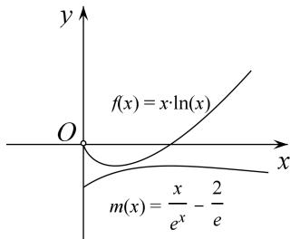

> [!faq]- 《专题18 单变量不含参不等式证明方法之凹凸反转-导数》例题解析
>
> > [!success]- **【答案】** 详见解析
>
> > [!note]- **【分析】**
> > 本题未单列分析。
>
> > [!note]- **【解析】**
> > (1)若对一切 $x \in (0, +\infty)$ , $2f(x) \geq g(x)$ 恒成立, 求实数 $a$ 的取值范围.
> >
> > (2)证明：对一切 $x \in (0, +\infty)$ ， $\ln x > \frac{1}{\mathrm{e}^x} - \frac{2}{\mathrm{e}x}$ 恒成立.
> >
> > 4. 解析
> > (1)由题意知 $2x \ln x \geq -x^2 + ax - 3$ 对一切 $x \in (0, +\infty)$ 恒成立，则 $a \leq 2 \ln x + x + \frac{3}{x}$ ,
> >
> > 设 $h(x)=2\ln x+x+\frac{3}{x}(x>0)$ ，则 $h'(x)=\frac{(x+3)(x-1)}{x^{2}}$ .
> > - **①**：当 $x \in (0, 1)$ 时， $h'(x) < 0$ ， $h(x)$ 单调递减；
> > - **②**：当 $x \in (1, +\infty)$ 时， $h'(x) > 0$ ， $h(x)$ 单调递增．所以 $h(x)_{\min} = h
> > (1) = 4$ ，
> >
> > 对一切 $x \in (0, +\infty)$ ， $2f(x) \geq g(x)$ 恒成立，所以 $a \leq h(x)_{\min} = 4$ ，即实数 a 的取值范围是 $(-∞, 4]$ .
> >
> > (2)问题等价于证明 $x \ln x > \frac{x}{\mathrm{e}^x} - \frac{2}{\mathrm{e}} (x > 0)$ . 又 $f(x) = x \ln x (x > 0)$ , $f'(x) = \ln x + 1$ ,
> >
> > 当 $x \in \begin{bmatrix} 0, & \frac{1}{\mathrm{e}} \end{bmatrix}$ 时， $f(x) < 0, f(x)$ 单调递减；当 $x \in \begin{bmatrix} \frac{1}{\mathrm{e}}, & +\infty \end{bmatrix}$ 时， $f(x) > 0, f(x)$ 单调递增，
> >
> > $$
> > f (x) _ {\min} = f \left(\frac {1}{\mathrm{e}}\right) = - \frac {1}{\mathrm{e}}.
> > $$
> >
> > 设 $m(x)=\frac{x}{e^{x}}-\frac{2}{e}(x>0)$ ，则 $m'(x)=\frac{1-x}{e^{x}}$ ,
> >
> > 当 $x \in (0, 1)$ 时， $m'(x) > 0$ ， $m(x)$ 单调递增，当 $x \in (1, +\infty)$ 时， $m'(x) < 0$ ， $m(x)$ 单调递减，
> > 所以 $m(x)_{\max}=m
> > (1)=-\frac{1}{e}$ ，从而对一切 $x\in(0,+\infty)$ ， $f(x)>m(x)$ 恒成立，即 $x\ln x>\frac{x}{e^{x}}-\frac{2}{e}$ 恒成立.
> > 即对一切 $x \in (0, +\infty)$ ， $\ln x > \frac{1}{e^{x}} - \frac{2}{ex}$ 恒成立.
> >
> > 
