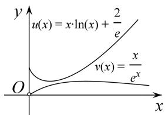

> [!faq]- 《专题18 单变量不含参不等式证明方法之凹凸反转-导数》例题解析
>
> > [!success]- **【答案】** 详见解析
>
> > [!note]- **【分析】**
> > 本题未单列分析。
>
> > [!note]- **【解析】**
> > (1)若函数 $y = g(x)$ 在 $\mathbf{R}$ 上存在零点，求实数 $b$ 的取值范围；
> >
> > (2)若函数 $y = f(x)$ 在 $x = \frac{1}{\mathrm{e}}$ 处的切线方程为 $\mathrm{ex} + y - 2 + b = 0$ . 求证：对任意的 $x \in (0, +\infty)$ ，总有 $f(x) > g(x)$ .
> >
> > 5. 解析
> > (1) 易得 $g'(x) = -\mathrm{e}^{-x} + b = b - \frac{1}{\mathrm{e}^x}$ . 若 $b = 0$ ，则 $g(x) = \frac{1}{\mathrm{e}^x} \in (0, +\infty)$ ，不合题意；若 $b < 0$ ，则 $g(0) = 1 > 0$ ， $g\left(-\frac{1}{b}\right) = \mathrm{e}^{\frac{1}{b}} - 1 < 0$ ，满足题设，若 $b > 0$ ，令 $g'(x) = -\mathrm{e}^{-x} + b = 0$ ，得 $x = -\ln b$ . $\therefore g(x)$ 在 $(- \infty, -\ln b)$ 上单调递减；在 $(- \ln b, +\infty)$ 上单调递增，则 $g(x)_{\min} = g(-\ln b) = \mathrm{e}^{\ln b} - b\ln b = b - b\ln b \leq 0$ ， $\therefore b \geq e$ 综上所述，实数 $b$ 的取值范围是 $(- \infty, 0) \cup [\mathrm{e}, +\infty)$ .
> >
> > (2)易得 $f(x)=\frac{1}{x}-\frac{a}{x^{2}}$ ，则由题意，得 $f\left(\frac{1}{e}\right)=e-ae^{2}=-e$ ，解得 $a=\frac{2}{e}$ .
> >
> > $$
> > \therefore f (x) = \ln x + \frac {2}{e x},
> > $$
> >
> > $$
> > f \binom{\frac {1}{\mathrm{e}}}{\mathrm{e}} = 1
> > $$
> >
> > $$
> > \left( \begin{array}{c c} \frac {1}{e}, & 1 \end{array} \right)
> > $$
> >
> > $$
> > \mathrm{e} x + y - 2 + b = 0
> > $$
> >
> > $$
> > b = 0. \quad \therefore g (x) = \mathrm{e} ^ {- x}
> > $$
> >
> > 要证 $f(x) > g(x)$ ，即证 $\ln x + \frac{2}{\mathrm{e}x} > \mathrm{e}^{-x}(x \in (0, +\infty))$ ，只需证 $x \ln x + \frac{2}{\mathrm{e}} > x \mathrm{e}^{-x}(x \in (0, +\infty))$ .
> >
> > 令 $u(x) = x\ln x + \frac{2}{\mathrm{e}}$ ， $v(x) = xe^{-x}$ ， $x\in (0, + \infty)$ .则由 $u^{\prime}(x) = \ln x + 1 = 0$ ，得 $x = \frac{1}{\mathrm{e}}$
> >
> > $\therefore u(x)$ 在 $\left[0, \frac{1}{e}\right]$ 上单调递减，在 $\left[\frac{1}{e}, +\infty\right]$ 上单调递增， $\therefore u(x)_{\min} = u\left[\frac{1}{e}\right] = \frac{1}{e}$ .
> >
> > 又由 $v'(x)=\mathrm{e}^{-x}-xe^{-x}=\mathrm{e}^{-x}(1-x)=0$ ，得 x=1，∴ $v(x)$ 在 $(0,1)$ 上单调递增，在 $(1,+\infty)$ 上单调递减， $\therefore v(x)_{\max}=v
> > (1)=\frac{1}{e}$ . $\therefore u(x)\geq u(x)_{\min}\geq v(x)_{\max}\geq v(x)$ ，显然，上式的等号不能同时取到.
> >
> > 故对任意的 $x \in (0, +\infty)$ ，总有 $f(x) > g(x)$ .
> >
> > 
