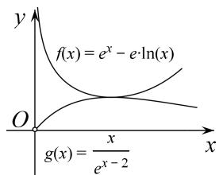

> [!faq]- 《专题18 单变量不含参不等式证明方法之凹凸反转-导数》例题解析
>
> > [!success]- **【答案】** 详见解析
>
> > [!note]- **【解析】**
> > 解析
> > (1) 当 $a = \mathbf{e}$ 时， $f(x) = \mathrm{e}^x - \mathrm{e}\ln x - \mathrm{e}$ ， $f'(x) = \mathrm{e}^x - \frac{\mathrm{e}}{x}$ ， $f' (1) = 0$ 。
> >
> > $f''(x)=\mathrm{e}^{x}+\frac{\mathrm{e}}{x^{2}}>0,\quad\therefore f'(x)$ 在 $(0,+\infty)$ 单调递增.
> >
> > ∴ $x \in (0, 1)$ 时， $f'(x) < f'
> > (1) = 0$ ， $x \in (1, +\infty)$ ， $f'(x) > f' (1) = 0$ 。
> >
> > $\therefore f(x)$ 在 $(0,1)$ 单调递减，在 $(1, +\infty)$ 单调递增． $\therefore f(x)$ 的极小值为 $f
> > (1) = 0$ ，无极大值.
> >
> > (2)由
> > (1)得 $\mathrm{e}^x -\mathrm{e}\ln x - \mathrm{e}\geq 0\Rightarrow \mathrm{e}^x -\mathrm{e}\ln x\geq \mathrm{e}$ ，所证不等式： $\mathrm{e}^{2x - 2} - \mathrm{e}^{x - 1}\ln x - x\geq 0\Leftrightarrow \mathrm{e}^x -\mathrm{e}\ln x\geq \frac{x}{\mathrm{e}^{x - 2}}$ 设 $g(x) = \frac{x}{\mathrm{e}^{x - 2}} = x\mathrm{e}^{2 - x}$ ， $g^{\prime}(x) = \mathrm{e}^{2 - x} - x\mathrm{e}^{2 - x} = (1 - x)\mathrm{e}^{2 - x}$ ，令 $g^{\prime}(x) > 0$ 可解得： $x <   1$ ：
> > ∴ $g(x)$ 在 $(0,1)$ 单调递增，在 $(1, + \infty)$ 单调递减．∴ $g(x)_{\max} = g
> > (1) = e$ ∴ $\mathrm{e}^x -\mathrm{e}\ln x\geq \mathrm{e}\geq g(x)$ ，即 $\mathrm{e}^x -\mathrm{e}\ln x\geq \frac{x}{\mathrm{e}^{x - 2}}$ ，∴ $\mathrm{e}^{2x - 2} - \mathrm{e}^{x - 1}\ln x - x\geq 0$
> >
> > 
