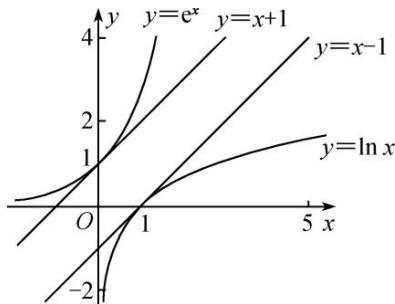
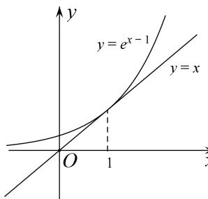
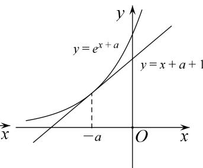
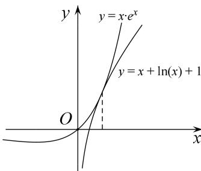
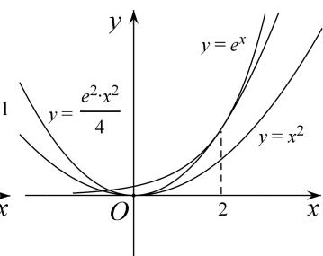
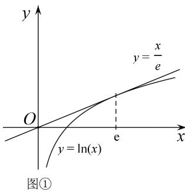
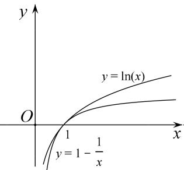
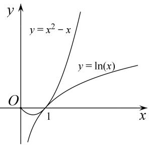
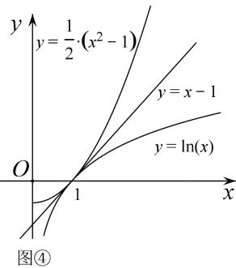

## 专题19 单变量不含参不等式证明方法之切线放缩

如图， $y = x + 1$ 是 $y = \mathrm{e}^x$ 在(0, 1)处的切线，有 $\mathrm{e}^x \geq x + 1$ 恒成立； $y = x - 1$ 是 $y = \ln x$ 在(1, 0)处的切线，有 $\ln x \leq x - 1$ 恒成立。在不等式“改造”或证明的过程中，有时借助于 $\mathrm{e}^x$ ， $\ln x$ 有关的常用不等式进行适当的放缩，再进行证明，会取得意想不到的效果。

由 $\mathrm{e}^x\geq x + 1$ 引出的放缩：

① $e^{x-1}\geq x$ （用x-1替换x，切点横坐标是x=1），通常表达为 $e^{x}\geq ex$ .

② $e^{x^{+}a}\geq x+a+1$ (用 $x+a$ 替换x，切点横坐标是x=-a)，平移模型，找到切点是关键.

③ $x\mathrm{e}^{x}\geq x+\ln x+1$ (用 $x+\ln x$ 替换 $x$ ，切点横坐标满足 $x+\ln x=0$ )，常见的指对跨阶改头换面模型，切线的方程是按照指数函数给予的.

④ $e^x \geq \frac{e^2}{4} x^2 > x^2 (x > 0) \left( \text{用} \frac{x}{2} \text{替换 } x, \text{ 切点横坐标是 } x = 2 \right)$ ，通常有 $e^{\frac{x}{n}} \geq \frac{ex}{n} (x > 0)$ 的构造模型.

图①

图②

图③

图④

由 $\ln x \leq x - 1$ (也可以记为 $\ln x \leq x$ ，切点为 $(1, 0)$ ) 引出的放缩：

最常见的就是 $\ln (x + 1)\leq x$ ，由 $\ln x <   x - 1$ 向左平移1个单位长度来理解，或者将 $\mathbf{e}^x\geq x + 1$ 两边取对数而来.

① $\ln x\leq\frac{x}{e}\left(\text{用}\frac{x}{e} \text{替换 }x, \text{切点横坐标是 }x=e\right)$ ，表示过原点的 $f(x)=\ln x$ 的切线为 $y=\frac{x}{e}$ .

② $\ln x \geq 1 - \frac{1}{x}\left(\text{用} \frac{1}{x} \text{替换 } x, \text{切点横坐标 } x = 1\right)$ , 或者记为 $x \ln x \geq x - 1$ .

③ $\ln x \leq x^2 - x$ (由 $\ln x \leq x - 1$ 及 $x - 1 \leq x^2 - x$ , 切点横坐标是 $x = 1$ ), 或者记为 $\frac{\ln x}{x} \leq x - 1$ .

④ $\ln x \leq \frac{1}{2}(x^2 - 1)$ 由 $\ln x \leq x - 1 \leq \frac{1}{2}(x^2 - 1)$ ，即在点(1, 0)处三曲线相切.

图②

图③

![[高中/总复习/专题/导数/专题19 单变量不含参不等式证明方法之切线放缩-导数/专题19_单变量不含参不等式证明方法之切线放缩/例题选讲/例题选讲.md]]
![[高中/总复习/专题/导数/专题19 单变量不含参不等式证明方法之切线放缩-导数/专题19_单变量不含参不等式证明方法之切线放缩/对点精练/对点精练.md]]
