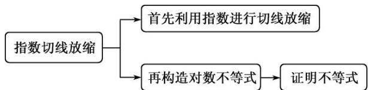

<!-- question-source:start -->
[例1] 求证：当 $x > 0$ 时，不等式 $2\mathrm{e}^{x - \frac{5}{2}} - \ln x + \frac{1}{x} > 0$ 恒成立.

【思维引导】

由常用不等式 $\mathrm{e}^x\geq x + 1$ ，得 $\mathrm{e}^{x - \frac{5}{2}}\geq x - \frac{3}{2}$ ，即 $2\mathrm{e}^{x - \frac{5}{2}}\geq 2x - 3$ ，于是可得到这道题的解题思路.

(1) = 0$ ,

所以 $2x - 3 \geq \ln x - \frac{1}{x}$ (当且仅当 $x = 1$ 时等号成立) ②.

因为①和②中的等号不能同时成立，所以由①和②，得 $2\mathrm{e}^{x - \frac{5}{2}} > \ln x - \frac{1}{x}$ ，所以 $2\mathrm{e}^{x - \frac{5}{2}} - \ln x + \frac{1}{x} > 0$ .

<!-- question-source:end -->

![[高中/总复习/专题/导数/专题19 单变量不含参不等式证明方法之切线放缩-导数/专题19_单变量不含参不等式证明方法之切线放缩/例题/answers/Q00043227A1.md]]
