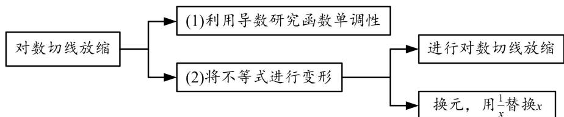

<!-- question-source:start -->
[例 3] 已知函数 $f(x)=\ln x-x+1$ .

(1)讨论 $f(x)$ 的单调性;

(2)求证：当 $x \in (1, +\infty)$ 时， $1 < \frac{x - 1}{\ln x} < x$ ；

【思维引导】

<!-- question-source:end -->

![[高中/总复习/专题/导数/专题19 单变量不含参不等式证明方法之切线放缩-导数/专题19_单变量不含参不等式证明方法之切线放缩/例题选讲/例题/answers/Q00022589A1.md]]
