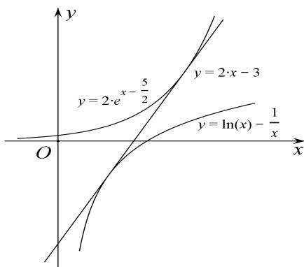

> [!faq]- 教师版例题解析
>
> > [!success]- **【答案】** 详见解析
>
> > [!note]- **【分析】**
> > 本题未单列分析。
>
> > [!note]- **【解析】**
> > 解析 令 $f(x) = 2\mathrm{e}^{x - \frac{5}{2}} - 2x + 3(x > 0)$ ，则 $f'(x) = 2\mathrm{e}^{x - \frac{5}{2}} - 2(x > 0)$ ，
> > 由 $f\left(\frac{5}{2}\right)=0$ ，可知 $f(x)$ 在 $\left(0,\frac{5}{2}\right]$ 上是减函数，在 $\left[\frac{5}{2},+\infty\right]$ 上是增函数，
> > 所以 $f(x) \geq f\left(\frac{5}{2}\right) = 0$ ，所以 $2e^{x - \frac{5}{2}} \geq 2x - 3$ （当且仅当 $x = \frac{5}{2}$ 时等号成立）
> > - **①**：.
> > 令 $g(x) = 2x - 3 - \ln x + \frac{1}{x} (x > 0)$ ，则 $g'(x) = 2 - \frac{1}{x} -\frac{1}{x^2} = \frac{(2x + 1)(x - 1)}{x^2} (x > 0),$
> > 易知 $g(x)$ 在 $(0, 1]$ 上是减函数，在 $[1, +\infty)$ 上是增函数，所以 $g(x) \geq g(1) = 0$ ,
> > 所以 $2x - 3 \geq \ln x - \frac{1}{x}$ (当且仅当 $x = 1$ 时等号成立) ②.
> > 因为①和②中的等号不能同时成立，所以由①和②，得 $2\mathrm{e}^{x - \frac{5}{2}} > \ln x - \frac{1}{x}$ ，所以 $2\mathrm{e}^{x - \frac{5}{2}} - \ln x + \frac{1}{x} > 0$ .
> > 
