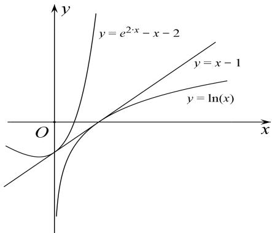

> [!faq]- 教师版对点精练解析
>
> > [!success]- **【答案】** 详见解析
>
> > [!note]- **【分析】**
> > 本题未单列分析。
>
> > [!note]- **【解析】**
> > 解析 (1) $f(x)$ 的定义域为 $(0, +\infty)$ ，当 a=0 时， $f(x)=\ln x$ 在 $(0, +\infty)$ 上单调递增；
> > 当 $a > 0$ 时， $f'(x) = \frac{1}{x} - 2a^2x + a = \frac{-2a^2x^2 + ax + 1}{x} = -\frac{(ax - 1)(2ax + 1)}{x},$
> > 当 $0 < x < \frac{1}{a}$ 时， $f'(x) > 0$ ，当 $x > \frac{1}{a}$ 时， $f'(x) < 0$ ，所以 $f(x)$ 在 $\left(0, \frac{1}{a}\right)$ 上单调递增，在 $\left(\frac{1}{a}, +\infty\right)$ 上单调递减；
> > 当 $a < 0$ 时， $f(x) = -\frac{(ax - 1)(2ax + 1)}{x}$ ，
> > 当 $0 < x < -\frac{1}{2a}$ 时， $f'(x) > 0$ ，当 $x > -\frac{1}{2a}$ 时， $f'(x) < 0$ ，所以 $f(x)$ 在 $\left[0, -\frac{1}{2a}\right]$ 上单调递增，在 $\left[-\frac{1}{2a}, +\infty\right]$ 上单调递减.
> > (2)当 a=1 时， $f(x)=\ln x-x^{2}+x$ ，要证当 x>0 时， $f(x)<\mathrm{e}^{2x}-x^{2}-2$ ，只需证 $\ln x<\mathrm{e}^{2x}-x-2$ .
> > 令 $g(x) = \mathrm{e}^{2x} - 2x - 1$ ，则 $g^{\prime}(x) = 2\mathrm{e}^{2x} - 2 = 2(\mathrm{e}^{2x} - 1),$
> > 当 x>0 时， $g'(x)>0$ ，所以 $g(x)$ 在 $(0, +\infty)$ 上单调递增，所以 $g(x)>g(0)=0$ ，
> > 所以，当 x>0 时， $e^{2x}>2x+1$ ，所以 $e^{2x}-x-2>x-1$ 。
> > 令 $h(x)=x-1-\ln x,\quad x>0$ ，则 $h'(x)=1-\frac{1}{x}$ ，当 0<x<1 时， $h'(x)<0$ ，当 x>1 时， $h'(x)>0$
> > 所以 $h(x)$ 在 $(0, 1)$ 上单调递减，在 $(1, +\infty)$ 上单调递增，所以 $h(x)_{\min}=h(1)=0$ ，
> > 所以当 x>0 时， $h(x)\geq h(1)=0$ ，即当 x>0 时， $x-1\geq\ln x$ ，
> > 所以，当 x>0 时， $e^{2x}-x-2>x-1\geq\ln x$ ，即 $\ln x<e^{2x}-x-2$ ，
> > 所以，当 x>0 时， $f(x)<\mathrm{e}^{2x}-x^{2}-2$ .
> > 
