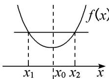
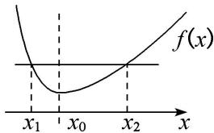
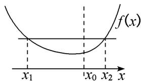

<!-- source-part:1 pages:1-11 -->

## 专题23 极值点偏移问题概述

## 一、极值点偏移的含义

函数 $f(x)$ 满足内任意自变量 $x$ 都有 $f(x) = f(2m - x)$ ，则函数 $f(x)$ 关于直线 $x = m$ 对称。可以理解为函数 $f(x)$ 在对称轴两侧，函数值变化快慢相同，且若 $f(x)$ 为单峰函数，则 $x = m$ 必为 $f(x)$ 的极值点 $x_0$ ，如图
(1)所示，函数 $f(x)$ 图象的顶点的横坐标就是极值点 $x_0$ ，若 $f(x) = c$ 的两根的中点则刚好满足 $\frac{x_1 + x_2}{2} = x_0$ ，则极值点在两根的正中间，也就是极值点没有偏移。

  
图
(1)

  
图
(2)

  
图
(3)

若 $\frac{x_{1}+x_{2}}{2}\neq x_{0}$ ，则极值点偏移。若单峰函数 $f(x)$ 的极值点为 $x_{0}$ ，且函数 $f(x)$ 满足定义域内x=m左侧的任意自变量x都有 $f(x)>f(2m-x)$ 或 $f(x)<f(2m-x)$ ，则函数 $f(x)$ 极值点 $x_{0}$ 左右侧变化快慢不同。如图
(2)
(3)所示。故单峰函数 $f(x)$ 定义域内任意不同的实数 $x_{1}$ ， $x_{2}$ ，满足 $f(x_{1})=f(x_{2})$ ，则 $\frac{x_{1}+x_{2}}{2}$ 与极值点 $x_{0}$ 必有确定的大小关系：若 $x_{0}<\frac{x_{1}+x_{2}}{2}$ ，则称为极值点左偏；若 $x_{0}>\frac{x_{1}+x_{2}}{2}$ ，则称为极值点右偏。

## 深层理解

![[高中/总复习/专题/导数/专题23　极值点偏移问题概述-导数/专题23_极值点偏移问题概述/对点训练/Q00043268.md]]
![[高中/总复习/专题/导数/专题23　极值点偏移问题概述-导数/专题23_极值点偏移问题概述/对点训练/Q00043269.md]]
![[高中/总复习/专题/导数/专题23　极值点偏移问题概述-导数/专题23_极值点偏移问题概述/例题/Q00043270.md]]
![[高中/总复习/专题/导数/专题23　极值点偏移问题概述-导数/专题23_极值点偏移问题概述/例题/Q00043271.md]]
![[高中/总复习/专题/导数/专题23　极值点偏移问题概述-导数/专题23_极值点偏移问题概述/例题/Q00043272.md]]
![[高中/总复习/专题/导数/专题23　极值点偏移问题概述-导数/专题23_极值点偏移问题概述/例题/Q00043273.md]]
