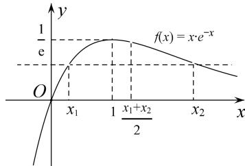

<!-- question-source:start -->
(1)f'(x)=\mathrm{e}^{-x}(1-x)$ ，令 $f'(x)>0$ 得 x<1；令 $f'(x)<0$ 得 x>1，
∴函数 $f(x)$ 在 $(-∞, 1)$ 上单调递增，在 $(1, +∞)$ 上单调递减，

∴ $f(x)$ 有极大值 $f
(1)=\frac{1}{e}$ ， $f(x)$ 无极小值.

(2)方法一 (对称化构造法)
<!-- question-source:end -->

![[高中/总复习/专题/导数/专题23　极值点偏移问题概述-导数/专题23_极值点偏移问题概述/例题/answers/Q00043271A1.md]]
