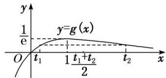

<!-- question-source:start -->
[例 2] 已知函数 $f(x)=\ln x-ax$ 有两个零点 $x_{1}, x_{2}$ .

(1)求实数 $a$ 的取值范围；

(2)求证： $x_{1}\cdot x_{2}>\mathrm{e}^{2}$

思维引导
(2) 证明 $x_{1}x_{2} > \mathrm{e}^{2}$ , 想到把双变量 $x_{1}, x_{2}$ 转化为只含有一个变量的不等式证明.

(1) $f'(x)=\frac{1}{x}-a=\frac{1-ax}{x}(x>0)$ ,

①若 $a \leq 0$ ，则 $f'(x) > 0$ ，不符合题意；

②若 $a > 0$ ，令 $f(x) = 0$ ，解得 $x = \frac{1}{a}$ 当 $x\in \left[0,\frac{1}{a}\right]$ 时， $f^{\prime}(x) > 0$ ；当 $x\in \left[\frac{1}{a}, + \infty \right]$ 时， $f^{\prime}(x) <   0$

由题意知 $f(x)=\ln x-ax$ 的极大值 $f\left(\frac{1}{a}\right)=\ln\frac{1}{a}-1>0$ ，解得 $0<a<\frac{1}{e}$ .

所以实数 a 的取值范围为 $\left(0, \frac{1}{e}\right)$ .

(2)法一：对称化构造法1

由 $x_{1}$ ， $x_{2}$ 是方程 $f(x)=0$ 的两个不同实根得 $a=\frac{\ln x}{x}$ ，令 $g(x)=\frac{\ln x}{x}$ ， $g(x_{1})=g(x_{2})$ ，由于 $g'(x)=\frac{1-\ln x}{x^{2}}$ ，因此， $g(x)$ 在 $(1,\mathrm{e})$ 上单调递增，在 $(\mathrm{e},+\infty)$ 上单调递减，设 $1<x_{1}<\mathrm{e}<x_{2}$ ，需证明 $x_{1}x_{2}>\mathrm{e}^{2}$ ，只需证明 $x_{1}>\frac{\mathrm{e}^{2}}{x_{2}}\in(1,\mathrm{e})$ ，只需证明 $f(x_{1})>f(\frac{\mathrm{e}^{2}}{x_{2}})$ ，即 $f(x_{2})>f(\frac{\mathrm{e}^{2}}{x_{2}})$ ，即 $f(x_{2})-f(\frac{\mathrm{e}^{2}}{x_{2}})>0$ 。

令 $h(x)=f(x)-f\left(\frac{\mathrm{e}^{2}}{x}\right)(x\in(1,\mathrm{e}))$ ， $h'(x)=\frac{(1-\ln x)(\mathrm{e}^{2}-x^{2})}{x^{2}\mathrm{e}^{2}}>0.$

故 $h(x)$ 在 $(1, \mathrm{e})$ 上单调递增，故 $h(x) < h(0) = 0$ 。即 $f(x) < f\left(\frac{\mathrm{e}^2}{x}\right)$ ，令 $x = x_1$ ，则 $f(x_2) = f(x_1) < f\left(\frac{\mathrm{e}^2}{x_1}\right)$ 因为 $x_2$ ， $\frac{\mathrm{e}^2}{x_1} \in (\mathrm{e}, +\infty)$ ， $f(x)$ 在 $(\mathrm{e}, +\infty)$ 上单调递减，所以 $x_1 > \frac{\mathrm{e}^2}{x_2}$ ，即 $x_1x_2 > \mathrm{e}^2$ 。

对称化构造法 2

由题意，函数 $f(x)$ 有两个零点 $x_{1}, x_{2}(x_{1} \neq x_{2})$ ，即 $f(x_{1}) = f(x_{2}) = 0$ ，易知 $\ln x_{1}, \ln x_{2}$ 是方程 $x = ae^{x}$ 的两根。令 $t_{1} = \ln x_{1}, t_{2} = \ln x_{2}$ 。设 $g(x) = xe^{-x}$ ，则 $g(t_{1}) = g(t_{2})$ ，从而 $x_{1}x_{2} > e^{2} \Leftrightarrow \ln x_{1} + \ln x_{2} > 2 \Leftrightarrow t_{1} + t_{2} > 2$ 。下证： $t_{1} + t_{2} > 2$ 。

$g'(x)=(1-x)e^{-x}$ ，易得 $g(x)$ 在 $(-∞, 1)$ 上单调递增，在 $(1, +∞)$ 上单调递减，

所以函数 $g(x)$ 在 x=1 处取得极大值 $g
(1)=\frac{1}{e}$ . 当 $x\to-\infty$ 时, $g(x)\to-\infty$ ; 当 $x\to+\infty$ 时, $g(x)\to0$ 且 $g(x)>0$ .

由 $g(t_{1})=g(t_{2})$ ， $t_{1}\neq t_{2}$ ，不妨设 $t_{1}<t_{2}$ ，作出函数 $g(x)$ 的图象如图所示，由图知必有 $0<t_{1}<1<t_{2}$ ，

令 $F(x)=g(1+x)-g(1-x)$ ， $x\in(0,1]$ ，则 $F'(x)=g'(1+x)-g'(1-x)=\frac{x}{\mathrm{e}^{x+1}}(\mathrm{e}^{2x}-1)>0$ ，

所以 $F(x)$ 在 $(0, 1]$ 上单调递增，所以 $F(x) > F(0) = 0$ 对任意的 $x \in (0, 1]$ 恒成立，

即 $g(1+x)>g(1-x)$ 对任意的 $x\in(0,1]$ 恒成立.

由 $0<t_{1}<1<t_{2}$ ，得 $1-t_{1}\in(0,1]$ ，所以 $g[1+(1-t_{1})]=g(2-t_{1})>g[1-(1-t_{1})]=g(t_{1})=g(t_{2})$ ，即 $g(2-t_{1})>g(t_{2})$ ，又 $2-t_{1}\in(1,+\infty)$ ， $t_{2}\in(1,+\infty)$ ，且 $g(x)$ 在 $(1,+\infty)$ 上单调递减，所以 $2-t_{1}<t_{2}$ ，即 $t_{1}+t_{2}>2$ 。

总结提升 上述解题过程就是解决极值点偏移问题的最基本的方法，共有四个解题要点：

(1)求函数 $g(x)$ 的极值点 $x_{0}$ ;

(2)构造函数 $F(x)=g(x_{0}+x)-g(x_{0}-x)$ ;

(3)确定函数 $F(x)$ 的单调性；

(4)结合 $F(0)=0$ ，确定 $g(x_{0}+x)$ 与 $g(x_{0}-x)$ 的大小关系.

其口诀为：极值偏离对称轴，构造函数觅行踪，四个步骤环相扣，两次单调紧跟随.

法二：比值换元法1

不妨设 $x_{1}>x_{2}>0$ ，因为 $\ln x_{1}-ax_{1}=0$ ， $\ln x_{2}-ax_{2}=0$ ，

所以 $\ln x_{1}+\ln x_{2}=a(x_{1}+x_{2})$ ， $\ln x_{1}-\ln x_{2}=a(x_{1}-x_{2})$ ，所以 $\frac{\ln x_{1}-\ln x_{2}}{x_{1}-x_{2}}=a$ ，

欲证 $x_{1}x_{2}>e^{2}$ ，即证 $\ln x_{1}+\ln x_{2}>2$ .

因为 $\ln x_{1}+\ln x_{2}=a(x_{1}+x_{2})$ ，所以即证 $a>\frac{2}{x_{1}+x_{2}}$ ,

所以原问题等价于证明 $\frac{\ln x_{1}-\ln x_{2}}{x_{1}-x_{2}}>\frac{2}{x_{1}+x_{2}}$ ，即 $\ln\frac{x_{1}}{x_{2}}>\frac{2(x_{1}-x_{2})}{x_{1}+x_{2}}$

令 $t = \frac{x_1}{x_2} (t > 1)$ ，则不等式变为 $\ln t > \frac{2(t - 1)}{t + 1}$ 。令 $h(t) = \ln t - \frac{2(t - 1)}{t + 1}$ ， $t > 1$ ，

所以 $h'(t)=\frac{1}{t}-\frac{4}{(t+1)^{2}}=\frac{(t-1)^{2}}{t(t+1)^{2}}>0$ ，所以 $h(t)$ 在 $(1,+\infty)$ 上单调递增，

所以 $h(t) > h
(1) = \ln 1 - 0 = 0$ ，即 $\ln t - \frac{2(t - 1)}{t + 1} >0(t > 1)$ ，因此原不等式 $x_{1}x_{2} > e^{2}$ 得证.

总结提升 用比值换元法求解本题的关键点有两个．一个是消参，把极值点转化为导函数零点之后，需要利用两个变量把参数表示出来，这是解决问题的基础，若只用一个极值点表示参数，如得到 $a=\frac{\ln x_{1}}{x_{1}}$ 之后，代入第二个方程，则无法建立两个极值点的关系，本题中利用两个方程相加(减)之后再消参，巧妙地把两个极值点与参数之间的关系建立起来；二是消“变”，即减少变量的个数，只有把方程转化为一个“变量”的式子后，才能建立与之相应的函数，转化为函数问题求解．本题利用参数a的值相等建立方程，进而利用对数运算的性质，将方程转化为关于 $\frac{x_{1}}{x_{2}}$ 的方程，通过建立函数模型求解该问题，这体现了对数学建模等核心素养的考查．

该方法的基本思路是直接消掉参数 a，再结合所证问题，巧妙引入变量 $c=\frac{x_{1}}{x_{2}}$ ，从而构造相应的函数。其解题要点为：

(1)联立消参：利用方程 $f(x_{1})=f(x_{2})$ 消掉解析式中的参数a.

(2)抓商构元：令 $t=\frac{x_{1}}{x_{2}}$ ，消掉变量 $x_{1}$ ， $x_{2}$ ，构造关于 t 的函数 $h(t)$ .

(3)用导求
(1)=\ln1-0=0$ ，即 $\ln t-\frac{2(t-1)}{t+1}>0(t>1)$ ，因此原不等式 $x_{1}x_{2}>e^{2}$ 得证.

法三：差值换元法

由题意，函数 $f(x)$ 有两个零点 $x_{1}$ ， $x_{2}(x_{1} \neq x_{2})$ ，即 $f(x_{1}) = f(x_{2}) = 0$ ，易知 $\ln x_{1}, \ln x_{2}$ 是方程 $x = ae^{x}$ 的两根。设 $t_{1} = \ln x_{1}$ ， $t_{2} = \ln x_{2}$ ，设 $g(x) = xe^{-x}$ ，则 $g(t_{1}) = g(t_{2})$ ，从而 $x_{1}x_{2} > e^{2} \Leftrightarrow \ln x_{1} + \ln x_{2} > 2 \Leftrightarrow t_{1} + t_{2} > 2$ 。

$$
t _ {1} + t _ {2} > 2
$$

由 $g(t_{1})=g(t_{2})$ ，得 $t_{1}e^{-t_{1}}=t_{2}e^{-t_{2}}$ ，化简得 $e^{t_{2}-t_{1}}=\frac{t_{2}}{t_{1}}$ ，①

不妨设 $t_{2}>t_{1}$ ，由法二知， $0<t_{1}<1<t_{2}$ 。令 $s=t_{2}-t_{1}$ ，则 s>0， $t_{2}=s+t_{1}$ ，代入①式，

得 $e^{s}=\frac{s+t_{1}}{t_{1}}$ ，解得 $t_{1}=\frac{s}{e^{s}-1}$ 。则 $t_{1}+t_{2}=2t_{1}+s=\frac{2s}{e^{s}-1}+s$ ，故要证 $t_{1}+t_{2}>2$ ，即证 $\frac{2s}{e^{s}-1}+s>2$ ，

又 $\mathrm{e}^s - 1 > 0$ ，故要证 $\frac{2s}{\mathrm{e}^s - 1} + s > 2$ ，即证 $2s + (s - 2)(\mathrm{e}^s - 1) > 0$ ，②

令 $G(s)=2s+(s-2)(e^{s}-1)(s>0)$ ，则 $G'(s)=(s-1)e^{s}+1$ ， $G''(s)=se^{s}>0$ ，

故 $G'(s)$ 在 $(0, +\infty)$ 上单调递增，所以 $G'(s) > G'(0) = 0$ ，从而 $G(s)$ 在 $(0, +\infty)$ 上单调递增，

所以 $G(s)>G(0)=0$ ，所以②式成立，故 $t_{1}+t_{2}>2$ 。

总结提升 该方法的关键是巧妙引入变量 $s$ ，然后利用等量关系，把 $t_1, t_2$ 消掉，从而构造相应的函数，转化所证问题。其解题要点为：

(1)取差构元：记 $s=t_{2}-t_{1}$ ，则 $t_{2}=t_{1}+s$ ，利用该式消掉 $t_{2}$ .

(2)巧解消参：利用 $g(t_{1}) = g(t_{2})$ ，构造方程，解之，利用 $s$ 表示 $t_1$

(3)构造函数：依据消参之后所得不等式的形式，构造关于 $s$ 的函数 $G(s)$ .

(4)转化求
<!-- question-source:end -->

![[高中/总复习/专题/导数/专题23　极值点偏移问题概述-导数/专题23_极值点偏移问题概述/例题/answers/Q00043272A1.md]]
