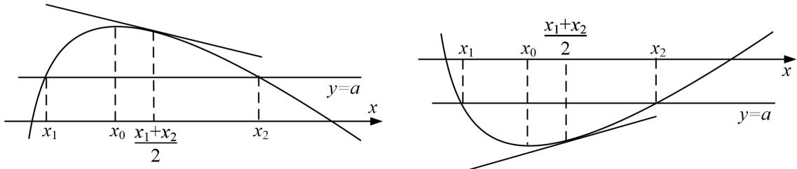
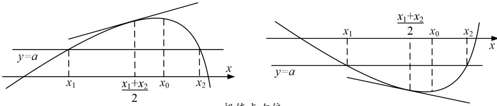

> [!faq]- 《专题23　极值点偏移问题概述-导数》例题解析
>
> > [!success]- **【答案】** 详见解析
>
> > [!note]- **【分析】**
> > 本题未单列分析。
>
> > [!note]- **【解析】**
> > (2)
> > (3).
> > 
> > 
> > 
> > (无偏移, 左右对称, 二次函数) (左陡右缓, 极值点向左偏移) (左缓右陡, 极值点向右偏移)
> > 若 $f(x_{1})=f(x_{2})$ ，则 $x_{1}+x_{2}=2x_{0}$ . 若 $f(x_{1})=f(x_{2})$ ，则 $x_{1}+x_{2}>2x_{0}$ . 若 $f(x_{1})=f(x_{2})$ ，则 $x_{1}+x_{2}<2x_{0}$ .
> > (1)
> > (2)
> > (3)
> > (1)极值点左偏： $x_{1}+x_{2}>2x_{0}$ ， $x=\frac{x_{1}+x_{2}}{2}$ 处切线与x轴不平行.
> > 若 $f(x)$ 上凸 $(f'(x)$ 递减），则 $f'(\frac{x_1 + x_2}{2}) < f'(x_0) = 0$ ，若 $f(x)$ 下凸 $(f'(x)$ 递增），则 $f'(\frac{x_1 + x_2}{2}) > f'(x_0) = 0.$
> > 
> > 极值点左偏
> > (2)极值点右偏： $x_{1}+x_{2}>2x_{0},\quad x=\frac{x_{1}+x_{2}}{2}$ 处切线与x轴不平行.
> > 若 $f(x)$ 上凸 $(f'(x)$ 递减），则 $f'(\frac{x_1 + x_2}{2}) < f'(x_0) = 0$ ，若 $f(x)$ 下凸 $(f'(x)$ 递增），则 $f'(\frac{x_1 + x_2}{2}) < f'(x_0) = 0.$
> > 
> > 极值点右偏
> > ## 二、极值点偏移问题的一般题设形式
> > (1)若函数 $f(x)$ 存在两个零点 $x_{1}$ ， $x_{2}$ 且 $x_{1} \neq x_{2}$ ，求证： $x_{1} + x_{2} > 2x_{0}$ （ $x_{0}$ 为函数 $f(x)$ 的极值点）；
> > (2)若函数 $f(x)$ 定义域中存在 $x_{1}$ ， $x_{2}$ 且 $x_{1} \neq x_{2}$ ，满足 $f(x_{1}) = f(x_{2})$ ，求证： $x_{1} + x_{2} > 2x_{0}$ （ $x_{0}$ 为函数 $f(x)$ 的极值点）；
> > (3)若函数 $f(x)$ 存在两个零点 $x_{1}$ ， $x_{2}$ 且 $x_{1} \neq x_{2}$ ，令 $x_{0} = \frac{x_{1} + x_{2}}{2}$ ，求证： $f'(x_{0}) > 0$ ;
> > (4)若函数 $f(x)$ 定义域中存在 $x_{1}$ ， $x_{2}$ 且 $x_{1} \neq x_{2}$ ，满足 $f(x_{1}) = f(x_{2})$ ，令 $x_{0} = \frac{x_{1} + x_{2}}{2}$ ，求证： $f'(x_0) > 0$ .
> > ## 三、极值点偏移问题的一般解法
> > ## 1. 对称化构造法
> > 主要用来解决与两个极值点之和，积相关的不等式的证明问题．其解题要点如下：
> > (1)定函数(极值点为 $x_{0}$ )，即利用导函数符号的变化判断函数的单调性，进而确定函数的极值点 $x_{0}$ .
> > (2)构造函数，即对结论 $x_{1} + x_{2} > 2x_{0}$ 型，构造函数 $F(x) = f(x) - f(2x_0 - x)$ 或 $F(x) = f(x_0 + x) - f(x_0 - x)$ ；对结论 $x_{1}x_{2} > x$ 型，构造函数 $F(x) = f(x) - f\left(\frac{x_0}{x}\right)$ ，通过研究 $F(x)$ 的单调性获得不等式.
> > (3)判断单调性，即利用导数讨论 $F(x)$ 的单调性.
> > (4)比较大小，即判断函数 $F(x)$ 在某段区间上的正负，并得出 $f(x)$ 与 $f(2x_{0}-x)$ 的大小关系.
> > (5)转化，即利用函数 $f(x)$ 的单调性，将 $f(x)$ 与 $f(2x_0 - x)$ 的大小关系转化为 $x$ 与 $2x_0 - x$ 之间的关系，进而得到所证或所求.
> > 若要证明 $f^{\prime}\left(\frac{x_{1}+x_{2}}{2}\right)$ 的符号问题，还需进一步讨论 $\frac{x_{1}+x_{2}}{2}$ 与 $x_{0}$ 的大小，得出 $\frac{x_{1}+x_{2}}{2}$ 所在的单调区间，从而
> > 得出该处导数值的正负.
> > ## 2. 比(差)值代换法
> > 比(差)值换元的目的也是消参、减元，就是根据已知条件首先建立极值点之间的关系，然后利用两个极值点之比(差)作为变量，从而实现消参、减元的目的。设法用比值或差值(一般用 t 表示)表示两个极值点，即 $t=\frac{x_{1}}{x_{2}}$ ，化为单变量的函数不等式，继而将所求解问题转化为关于 t 的函数问题求解。
> > ## 3. 对数均值不等式法
> > 两个正数 a 和 b 的对数平均定义： $L(a, b) = \begin{cases} \frac{a - b}{\ln a - \ln b} & (a \neq b), \\ a (a = b). \end{cases}$
> > 对数平均与算术平均、几何平均的大小关系： $\sqrt{ab} \leq L(a, b) \leq \frac{a + b}{2}$ （此式记为对数平均不等式）
> > 取等条件：当且仅当 a=b 时，等号成立.
> > 只证：当 $a \neq b$ 时， $\sqrt{ab} < L(a, b) < \frac{a + b}{2}$ 。不失一般性，可设 $a > b$ 。证明如下：
> > (1)先证： $\sqrt{ab} < L(a,b)$ ①
> > 不等式① $\Leftrightarrow \ln a - \ln b <   \frac{a - b}{\sqrt{ab}}\Leftrightarrow \ln \frac{a}{b} <  \sqrt{\frac{a}{b}} -\sqrt{\frac{b}{a}}\Leftrightarrow 2\ln x <   x - \frac{1}{x} (\text{其中} x = \sqrt{\frac{a}{b}} >1)$
> > 构造函数 $f(x) = 2\ln x - (x - \frac{1}{x}), (x > 1)$ ，则 $f'(x) = \frac{2}{x} - 1 - \frac{1}{x^2} = -(1 - \frac{1}{x})^2$ .
> > 因为 x > 1 时， $f'(x) < 0$ ，所以函数 $f(x)$ 在 $(1, +\infty)$ 上单调递减，
> > 故 $f(x) < f
> > (1) = 0$ ，从而不等式①成立；
> > (2)再证： $L(a, b) < \frac{a + b}{2}$ ②
> > 不等式② $\Leftrightarrow \ln a - \ln b > \frac{2(a - b)}{a + b} \Leftrightarrow \ln \frac{a}{b} > \frac{2(\frac{a}{b} - 1)}{(\frac{a}{b} + 1)} \Leftrightarrow \ln x > \frac{2(x - 1)}{(x + 1)}$ (其中 $x = \sqrt{\frac{a}{b}} > 1$ )
> > 构造函数 $g(x)=\ln x-\frac{2(x-1)}{(x+1)}$ ，(x>1)，则 $g'(x)=\frac{1}{x}-\frac{4}{(x+1)^{2}}=\frac{(x-1)^{2}}{x(x+1)^{2}}$ .
> > 因为 $x > 1$ 时， $g'(x) > 0$ ，所以函数 $g(x)$ 在 $(1, +\infty)$ 上单调递增，
> > 故 $g(x) < g
> > (1) = 0$ ，从而不等式②成立；
> > 综合
> > (1)
> > (2)知，对 $\forall a, b \in \mathbf{R}^{+}$ ，都有对数平均不等式 $\sqrt{ab} \leq L(a, b) \leq \frac{a + b}{2}$ 成立，当且仅当 $a = b$ 时，等号成立.
> > [例 1] (2010 天津) 已知函数 $f(x)=xe^{-x}(x\in\mathbf{R})$ .
