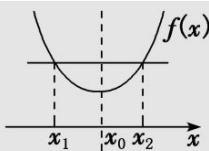
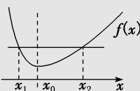
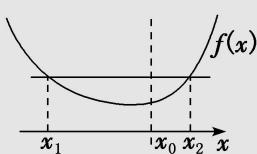

<!-- question-source:start -->
2. 若 $\frac{x_1 + x_2}{2} \neq x_0$ ，则极值点偏移，此时函数 $f(x)$ 在 $x = x_0$ 两侧，函数值变化快慢不同，如图(2)(3).

(无偏移, 左右对称, 二次函数) (左陡右缓, 极值点向左偏移) (左缓右陡, 极值点向右偏移)
若 $f(x_{1})=f(x_{2})$ ，则 $x_{1}+x_{2}=2x_{0}$ . 若 $f(x_{1})=f(x_{2})$ ，则 $x_{1}+x_{2}>2x_{0}$ . 若 $f(x_{1})=f(x_{2})$ ，则 $x_{1}+x_{2}<2x_{0}$ .
<!-- question-source:end -->

![[高中/总复习/专题/导数/专题23　极值点偏移问题概述-导数/专题23_极值点偏移问题概述_导数/对点训练/answers/Q00040597A1.md]]
