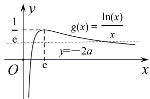

> [!faq]- 《专题25　极值点偏移之积(x1x2)型不等式的证明-导数》例题解析
>
> > [!success]- **【答案】** 详见解析
>
> > [!note]- **【解析】**
> > 解析
> > (1) 函数 $f(x)=x\ln x+ax^{2}-x+a(a\in\mathbf{R})$ 的定义域为 $(0,+\infty)$ ， $f'(x)=\ln x+2ax$ .
> >
> > ∵ 函数 $f(x)=x\ln x+ax^{2}-x+a(a\in\mathbf{R})$ 在其定义域内有两个不同的极值点.
> >
> > ∴ 方程 $f'(x)=0$ 在 $(0, +\infty)$ 有两个不同根；
> >
> > 转化为函数 $g(x)=\frac{\ln x}{x}$ 与函数 y=-2a 的图象在 $(0,+\infty)$ 上有两个不同交点.
> >
> > 又 $g'(x) = \frac{1 - \ln x}{x^2}$ ，即 $0 < x < e$ 时， $g'(x) > 0$ ， $x > e$ 时， $g'(x) < 0$ ，
> >
> > 故 $g(x)$ 在 $(0, e)$ 上单调增，在 $(e, +\infty)$ 上单调减．故 $g(x)_{\text{极大}} = g(e) = \frac{1}{e}$ .
> >
> > 又 $g(x)$ 有且只有一个零点是 1，且在 $x \to 0$ 时， $g(x) \to -\infty$ ，在在 $x \to +\infty$ 时， $g(x) \to 0$ ，
> >
> > 故 $g(x)$ 的草图如图， $\therefore 0 < -2a < \frac{1}{\mathrm{e}}$ ，即 $-\frac{1}{2\mathrm{e}} < a < 0$ 。故 $a$ 的取值范围为 $(- \frac{1}{2\mathrm{e}}, 0)$ 。
> >
> > 
> >
> > (2)由
> > (1)可知 $x_{1}$ ， $x_{2}$ 分别是方程 $\ln x + 2a = 0$ 的两个根，即 $\ln x_{1} = -2ax_{1}$ ， $\ln x_{2} = -2ax_{2}$ ，
> >
> > 设 $x_{1} > x_{2}$ ，作差得 $\ln \frac{x_1}{x_2} = -2a(x_1 - x_2)$ .得 $-2a = \frac{\ln\frac{x_1}{x_2}}{x_1 - x_2}$
> >
> > 要证明 $x_{1}x_{2} > e^{2}$ 。只需证明 $\ln x_{1} + \ln x_{2} > 2$ 。
> >
> > $\Leftarrow -2a(x_{1} + x_{2}) > 2$ ， $\Leftarrow \frac{\ln\frac{x_1}{x_2}}{x_1 - x_2}(x_1 + x_2) > 2$ ，即只需证明 $\ln \frac{x_1}{x_2} >\frac{2(x_1 - x_2)}{x_1 + x_2}$
> >
> > 令 $\frac{x_1}{x_2} = t$ ，则 $t > 1$ ，只需证明 $\ln t > \frac{2(t - 1)}{t + 1}$
> >
> > 设 $g(t) = \ln t - \frac{2(t - 1)}{t + 1} (t > 1)$ ， $g'(t) = \frac{(t - 1)^2}{t(t + 1)} > 0$ 。∴函数 $g(t)$ 在 $(1, +\infty)$ 上单调递增，
> >
> > $\therefore g(t) > g
> > (1) = 0$ ，故 $\ln t > \frac{2(t - 1)}{t + 1}$ 成立． $\therefore x_{1}x_{2} > e^{2}$ 成立.
