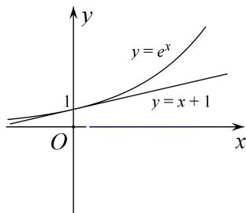
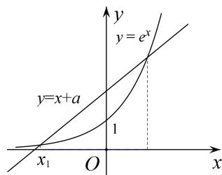

> [!faq]- 《专题25　极值点偏移之积(x1x2)型不等式的证明-导数》例题解析
>
> > [!success]- **【答案】** 详见解析
>
> > [!note]- **【分析】**
> > 本题未单列分析。
>
> > [!note]- **【解析】**
> > (1)求实数 $a$ 的取值范围;
> > (2)求证： $f(x_{1})+f(x_{2})>2$ .
> > 解析 (1)由于 $f(x)=\mathrm{e}^{x}-\frac{1}{2}x^{2}-ax$ ，则 $f'(x)=\mathrm{e}^{x}-x-a$ ，
> > 设 $g(x) = f'(x) = \mathrm{e}^x - x - a$ ，则 $g'(x) = \mathrm{e}^x - 1$ ，令 $g'(x) = \mathrm{e}^x - 1 = 0$ ，解得 $x = 0$ .
> > 所以当 $x \in (-\infty, 0)$ 时， $g'(x) < 0$ ；当 $x \in (0, +\infty)$ 时， $g'(x) > 0$ 。所以 $g(x)_{\min} = g(0) = 1 - a$ 。
> > - **①**：当 $a \leq 1$ 时， $g(x) = f'(x) \geq 0$ ，所以函数 $f(x)$ 单调递增，没有极值点；
> > - **②**：当 a>1 时， $g(x)_{\min}=1-a<0$ ，且当当 $x\to-\infty$ 时， $g(x)\to+\infty$ ；当 $x\to+\infty$ 时， $g(x)\to+\infty$ .
> > $$
> > g (x) = f ^ {\prime} (x) = \mathrm{e} ^ {x} - x - a
> > $$
> > $$
> > x _ {1}, \quad x _ {2}
> > $$
> > $$
> > x _ {1} <   x _ {2}
> > $$
> > $$
> > x _ {1} <   0 <   x _ {2}
> > $$
> > 所以函数 $f(x)=\mathrm{e}^{x}-\frac{1}{2}x^{2}-ax$ 有两个极值点时，实数 a 的取值范围是 $(1,+\infty)$ ;
> > 答案速得 函数 $f(x)$ 有两个极值点实质上就是其导数 $f'(x)$ 有两个零点，亦即函数 $y = \mathrm{e}^x$ 与直线 $y = x + a$ 有两个交点，如图所示，显然实数 $a$ 的取值范围是 $(1, +\infty)$ .
> > 
> > (2)由(1)知， $x_{1}$ ， $x_{2}$ 为 $g(x)=0$ 的两个实数根， $x_{1}<0<x_{2}$ ， $g(x)$ 在 $(-∞,0)$ 上单调递减.
> > 下面先证 $x_{1}<-x_{2}<0$ ，只需证 $g(-x_{2})<g(x_{1})=0$ ，由于 $g(x_{2})=\mathrm{e}^{x_{2}}-x_{2}-a=0$ ，得 $a=\mathrm{e}^{x_{2}}-x_{2}$ ，所以 $g(-x_{2})=\mathrm{e}^{-x_{2}}+x_{2}-a=\mathrm{e}^{-x_{2}}-\mathrm{e}^{x_{2}}+2x_{2}$ .
> > 设 $h(x)=\mathrm{e}^{-x}-\mathrm{e}^{x}+2x(x>0)$ ，则 $h'(x)=-\frac{1}{\mathrm{e}^{x}}-\mathrm{e}^{x}+2<0$ ，所以 $h(x)$ 在 $(0,+\infty)$ 上单调递减，
> > 所以 $h(x)<h(0)=0,\quad h(x_{2})=g(-x_{2})<0$ ，所以 $x_{1}<-x_{2}<0$ .
> > 由于函数 $f(x)$ 在 $(x_{1},0)$ 上也单调递减，所以 $f(x_{1})>f(-x_{2})$ .
> > 要证 $f(x_{1}) + f(x_{2}) > 2$ ，只需证 $f(-x_{2}) + f(x_{2}) > 2$ ，即证 $e^{x_{2}} + e^{-x_{2}} - x_{2}^{2} - 2 > 0$ .
> > 设函数 $k(x)=\mathrm{e}^{x}+\mathrm{e}^{-x}-x^{2}-2,\quad x\in(0,+\infty)$ ，则 $k'(x)=\mathrm{e}^{x}-\mathrm{e}^{-x}-2x.$ 设 $r(x)=k'(x)=\mathrm{e}^{x}-\mathrm{e}^{-x}-2x$ ，则 $r'(x)=\mathrm{e}^{x}+\mathrm{e}^{-x}-2>0$
> > 
> > 所以 $r(x)$ 在 $(0, +\infty)$ 上单调递增， $r(x) > r(0) = 0$ ，即 $k'(x) > 0$ .
> > 所以 $k(x)$ 在 $(0, +\infty)$ 上单调递增， $k(x) > k(0) = 0$ .
> > 故当 $x \in (0, +\infty)$ 时， $\mathrm{e}^{x} + \mathrm{e}^{-x} - x^{2} - 2 > 0$ ，则 $\mathrm{e}^{x_{2}} + \mathrm{e}^{-x_{2}} - x_{2}^{2} - 2 > 0$
> > 所以 $f(-x_{2})+f(x_{2})>2$ ，亦即 $f(x_{1})+f(x_{2})>2$ .
> > 总结提升 本题是极值点偏移问题的泛化，是拐点的偏移，依然可以使用极值点偏移问题的有关方法来解决。只不过需要挖掘出拐点偏移中隐含的拐点的不等关系，如本题中的 $x_{1} < -x_{2} < 0$ ，如果“脑中有‘形’”，如图所示，并不难得出。
> > ## 【对点训练】
