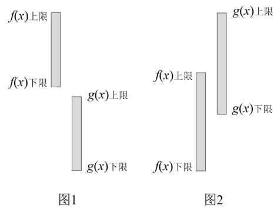
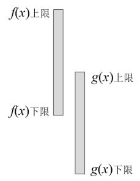
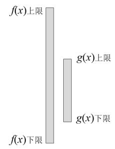
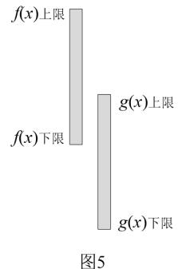

<!-- source-part:1 pages:1-10 -->

# 专题35 双变量恒成立与能成立问题概述

## 【方法总结】

## 1. 最值定位法解双变量不等式恒成立问题的思路策略

(1)用最值定位法解双变量不等式恒成立问题是指通过不等式两端的最值进行定位, 转化为不等式两端函数的最值之间的不等式, 列出参数所满足的不等式, 从而求解参数的取值范围.

(2)有关两个函数在各自指定范围内的不等式恒成立问题, 这里两个函数在指定范围内的自变量是没有关联的, 这类不等式的恒成立问题就应该通过最值进行定位.

## 2. 常见的双变量恒成立能成立问题的类型

(1)对于任意的 $x_{1} \in [a, b]$ , $x_{2} \in [m, n]$ , 使得 $f(x_{1}) \geq g(x_{2}) \Leftrightarrow f(x_{1})_{\min} \geq g(x_{2})_{\max}$ . (如图1)

(2)若存在 $x_{1}\in [a,b]$ ，总存在 $x_{2}\in [m,n]$ ，使得 $f(x_{1})\geq g(x_{2})\Leftrightarrow f(x_{1})_{\max}\geq g(x_{2})_{\min}$ .（如图2）

(3)对于任意的 $x_{1} \in [a, b]$ ，总存在 $x_{2} \in [m, n]$ ，使得 $f(x_{1}) \geq g(x_{2}) \Leftrightarrow f(x_{1})_{\min} \geq g(x_{2})_{\min}$ . (如图3)

(4)若存在 $x_{1}\in [a,b]$ ，对任意的 $x_{2}\in [m,n]$ ，使得 $f(x_{1})\geq g(x_{2})\Leftrightarrow f(x_{1})_{\max}\geq g(x_{2})_{\max}$ .（如图4）

(5)若存在 $x_{1}\in [a,b]$ ，对任意的 $x_{2}\in [m,n]$ ，使得 $f(x_{1}) = g(x_{2})\Leftrightarrow f(x_{1})_{\max}\geq g(x_{2})_{\max}$ .（如图4）

(6)若存在 $x_{1} \in [a, b]$ , 总存在 $x_{2} \in [m, n]$ , 使得 $f(x_{1}) = g(x_{2}) \Leftrightarrow f(x)$ 的值域与 $g(x)$ 的值域的交集非空. (如图5)

![[高中/总复习/专题/导数/专题35   双变量恒成立与能成立问题概述-导数/考点01_双任意与双存在不等问题/考点01_双任意与双存在不等问题.md]]
![[高中/总复习/专题/导数/专题35   双变量恒成立与能成立问题概述-导数/考点02_存在与任意嵌套不等问题/考点02_存在与任意嵌套不等问题.md]]
![[高中/总复习/专题/导数/专题35   双变量恒成立与能成立问题概述-导数/考点03_双任意与存在相等问题/考点03_双任意与存在相等问题.md]]
