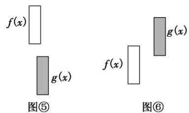

## 考点一 双任意与双存在不等问题

(1) $f(x)$ ， $g(x)$ 是在闭区间 D 上的连续函数且 $\forall x_{1}, x_{2} \in D$ ，使得 $f(x_{1}) > g(x_{2})$ ，等价于 $f(x)_{\min} > g(x)_{\max}$ 。其等价转化的目标是函数 $y = f(x)$ 的任意一个函数值均大于函数 $y = g(x)$ 的任意一个函数值。如图⑤。

(2)存在 $x_{1}$ , $x_{2} \in D$ , 使得 $f(x_{1}) > g(x_{2})$ , 等价于 $f(x)_{\max} > g(x)_{\min}$ . 其等价转化的目标是函数 $y = f(x)$ 的某一个函数值大于函数 $y = g(x)$ 的某些函数值. 如图⑥.

## 【例题选讲】

![[高中/总复习/专题/导数/专题35   双变量恒成立与能成立问题概述-导数/考点01_双任意与双存在不等问题/例题/Q00040736.md]]
![[高中/总复习/专题/导数/专题35   双变量恒成立与能成立问题概述-导数/考点01_双任意与双存在不等问题/例题/Q00040737.md]]
![[高中/总复习/专题/导数/专题35   双变量恒成立与能成立问题概述-导数/考点01_双任意与双存在不等问题/例题/Q00040738.md]]
![[高中/总复习/专题/导数/专题35   双变量恒成立与能成立问题概述-导数/考点01_双任意与双存在不等问题/例题/Q00040739.md]]
