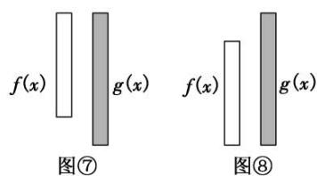

## 考点二 存在与任意嵌套不等问题

(1) $\forall x_{1} \in D_{1}$ , $\exists x_{2} \in D_{2}$ , 使 $f(x_{1}) > g(x_{2})$ , 等价于函数 $f(x)$ 在 $D_{1}$ 上的最小值大于 $g(x)$ 在 $D_{2}$ 上的最小值, 即 $f(x)_{\min} > g(x)_{\min}$ (这里假设 $f(x)_{\min}$ , $g(x)_{\min}$ 存在). 其等价转化的目标是函数 $y = f(x)$ 的任意一个函数值大于函数 $y = g(x)$ 的某一个函数值. 如图⑦.

(2) $\forall x_{1}\in D_{1},\exists x_{2}\in D_{2}$ ，使 $f(x_{1})<g(x_{2})$ ，等价于函数 $f(x)$ 在 $D_{1}$ 上的最大值小于 $g(x)$ 在 $D_{2}$ 上的最大值，即$f(x)_{\max} < g(x)_{\max}$ . 其等价转化的目标是函数 $y = f(x)$ 的任意一个函数值小于函数 $y = g(x)$ 的某一个函数值. 如图⑧.

## 【例题选讲】

![[高中/总复习/专题/导数/专题35   双变量恒成立与能成立问题概述-导数/考点02_存在与任意嵌套不等问题/例题/Q00040740.md]]
![[高中/总复习/专题/导数/专题35   双变量恒成立与能成立问题概述-导数/考点02_存在与任意嵌套不等问题/例题/Q00040741.md]]
