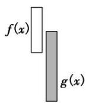
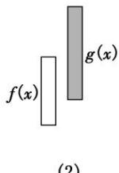
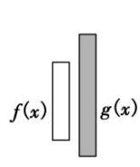

## 考点三 双任意与存在相等问题

(1) $\exists x_{1} \in D_{1}$ , $\exists x_{2} \in D_{2}$ , 使得 $f(x_{1}) = g(x_{2})$ 等价于函数 $f(x)$ 在 $D_{1}$ 上的值域 $A$ 与 $g(x)$ 在 $D_{2}$ 上的值域 $B$ 的交集不是空集, 即 $A \cap B \neq \emptyset$ , 如图⑨. 其等价转化的目标是两个函数有相等的函数值.

(2)
  
(1)

  
图⑨

  
图⑩

(2) $\forall x_{1} \in D_{1}$ , $\exists x_{2} \in D_{2}$ , 使得 $f(x_{1}) = g(x_{2})$ 等价于函数 $f(x)$ 在 $D_{1}$ 上的值域 $A$ 是 $g(x)$ 在 $D_{2}$ 上的值域 $B$ 的子集, 即 $A \subseteq B$ , 如图⑩. 其等价转化的目标是函数 $y = f(x)$ 的值域都在函数 $y = g(x)$ 的值域之中.

说明：图⑨，图⑩中的条形图表示函数在相应定义域上的值域在 $y$ 轴上的投影.

## 【例题选讲】

![[高中/总复习/专题/导数/专题35   双变量恒成立与能成立问题概述-导数/考点03_双任意与存在相等问题/例题/Q00043422.md]]
![[高中/总复习/专题/导数/专题35   双变量恒成立与能成立问题概述-导数/考点03_双任意与存在相等问题/例题/Q00043423.md]]
![[高中/总复习/专题/导数/专题35   双变量恒成立与能成立问题概述-导数/考点03_双任意与存在相等问题/例题/Q00043424.md]]
![[高中/总复习/专题/导数/专题35   双变量恒成立与能成立问题概述-导数/考点03_双任意与存在相等问题/例题/Q00043425.md]]
![[高中/总复习/专题/导数/专题35   双变量恒成立与能成立问题概述-导数/考点03_双任意与存在相等问题/例题/Q00043426.md]]
