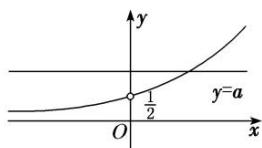

<!-- question-source:start -->
[例1] 已知 $f(x) = \mathrm{e}^{-x}(ax^2 + x + 1)$ . 当 $a > 0$ 时，试讨论方程 $f(x) = 1$ 的解的个数.

[破题思路] 讨论方程 $f(x) = 1$ 的解的个数，想到 $f(x) - 1$ 的零点个数，给出 $f(x)$ 的解析式，用 $f(x) = 1$ 构造函数，转化为零点问题求解(或分离参数，结合图象求解).

[规范解答]

法一：分类讨论法

方程 $f(x)=1$ 的解的个数即为函数 $h(x)=\mathrm{e}^{x}-ax^{2}-x-1(a>0)$ 的零点个数．而 $h'(x)=\mathrm{e}^{x}-2ax-1$

设 $H(x)=\mathrm{e}^{x}-2ax-1$ ，则 $H'(x)=\mathrm{e}^{x}-2a$ 。令 $H'(x)>0$ ，解得 $x>\ln 2a$ ；令 $H'(x)<0$ ，

(1)=0$ ，即 $h'(x)_{\min}\leq0$ （当 m=1 即 $a=\frac{1}{2}$ 时取等号）.

①当 $a=\frac{1}{2}$ 时， $h'(x)_{\min}=0$ ，则 $h'(x)\geq0$ 恒成立．所以 $h(x)$ 在 R 上单调递增，故此时 $h(x)$ 只有一个零点.
②当 $a>\frac{1}{2}$ 时， $\ln 2a>0,\quad h'(x)_{\min}=h'(\ln 2a)<0,$

又 $h'(x)$ 在 $(-\infty, \ln 2a)$ 上单调递减，在 $(\ln 2a, +\infty)$ 上单调递增，

又 $h'(0)=0$ ，则存在 $x_{1}>0$ 使得 $h'(x_{1})=0$ ，

这时 $h(x)$ 在 $(-∞, 0)$ 上单调递增，在 $(0, x_{1})$ 上单调递减，在 $(x_{1}, +∞)$ 上单调递增.

所以 $h(x_{1})<h(0)=0$ ，又 $h(0)=0$ ，所以此时 $h(x)$ 有两个零点.

③当 $0 < a < \frac{1}{2}$ 时， $\ln 2a < 0$ ， $h'(x)_{\min} = h'(\ln 2a) < 0$ ，

又 $h'(x)$ 在 $(-∞, �ln 2a)$ 上单调递减，在 $(\ln 2a, +∞)$ 上单调递增，

又 $h'(0)=0$ ，则存在 $x_{2}<0$ 使得 $h'(x_{2})=0$ .

这时 $h(x)$ 在 $(-∞, x_{2})$ 上单调递增，在 $(x_{2}, 0)$ 上单调递减，在 $(0, +∞)$ 上单调递增，

所以 $h(x_{2})>h(0)=0,\quad h(0)=0$ ，所以此时 $f(x)$ 有两个零点.

综上，当 $a = \frac{1}{2}$ 时，方程 $f(x) = 1$ 只有一个解；当 $a \neq \frac{1}{2}$ 且 $a > 0$ 时，方程 $f(x) = 1$ 有两个解.

法二：分离参数法

方程 $f(x)=1$ 的解的个数即方程 $e^{x}-ax^{2}-x-1=0(a>0)$ 的解的个数，方程可化为 $ax^{2}=e^{x}-x-1$ .
当 x=0 时，方程为 $0=e^{0}-0-1$ ，显然成立，所以 x=0 为方程的解.

当 $x \neq 0$ 时，分离参数可得 $a = \frac{\mathrm{e}^x - x - 1}{x^2} (x \neq 0)$ .

设函数 $p(x) = \frac{\mathrm{e}^x - x - 1}{x^2} (x \neq 0)$ ，则 $p'(x) = \frac{(\mathrm{e}^x - x - 1)' \cdot x^2 - (x^2)' \cdot (\mathrm{e}^x - x - 1)}{(x^2)^2} = \frac{\mathrm{e}^x(x - 2) + x + 2}{x^3}$ .

记 $q(x)=\mathrm{e}^{x}(x-2)+x+2$ ，则 $q'(x)=\mathrm{e}^{x}(x-1)+1$ .

记 $t(x)=q'(x)=\mathrm{e}^{x}(x-1)+1$ ，则 $t'(x)=xe^{x}$ 。显然当 x<0 时， $t'(x)<0$ ，函数 $t(x)$ 单调递减；当 x>0 时， $t'(x)>0$ ，函数 $t(x)$ 单调递增。所以 $t(x)>t(0)=\mathrm{e}^{0}(0-1)+1=0$ ，即 $q'(x)>0$ ，

所以函数 $q(x)$ 单调递增．而 $q(0)=\mathrm{e}^{0}(0-2)+0+2=0$ ，

所以当 x<0 时， $q(x)<0$ ，即 $p'(x)>0$ ，函数 $p(x)$ 单调递增；

当 x>0 时， $q(x)>0$ ，即 $p'(x)>0$ ，函数 $p(x)$ 单调递增.

而当 $x \to 0$ 时， $p(x) \to \frac{(\mathrm{e}^{x} - x - 1)^{\prime}}{(x^{2})^{\prime}}_{x \to 0} = \frac{\mathrm{e}^{x} - 1}{2x}$ $_{x \to 0} = \frac{(\mathrm{e}^{x} - 1)^{\prime}}{(2x)^{\prime}}_{x \to 0} = \frac{\mathrm{e}^{x}}{2}$ $_{x \to 0} = \frac{1}{2}$ (洛必达法则)，

当 $x \to -\infty$ 时， $p(x) \to \frac{(\mathrm{e}^x - x - 1)'}{(x^2)'}_{x \to -\infty} = \frac{\mathrm{e}^x - 1}{2x}_{x \to -\infty} = 0,$

故函数 $p(x)$ 的图象如图所示．作出直线 y=a.

显然，当 $a=\frac{1}{2}$ 时，直线 y=a 与函数 $p(x)$ 的图象无交点，即方程 $e^{x}-ax^{2}-x-1=0$ 只有一个解 x=0;

当 $a \neq \frac{1}{2}$ 且 a > 0 时，直线 y = a 与函数 $p(x)$ 的图象有一个交点 $(x_{0}, a)$ ,

即方程 $e^{x}-ax^{2}-x-1=0$ 有两个解 x=0 或 $x=x_{0}$ .

综上，当 $a = \frac{1}{2}$ 时，方程 $f(x) = 1$ 只有一个解；当 $a \neq \frac{1}{2}$ 且 $a > 0$ 时，方程 $f(x) = 1$ 有两个解.

[注] 部分题型利用分离法处理时，会出现“ $\frac{0}{0}$ ”型的代数式，这是大学数学中的不定式问题，解决这类问题有效的方法就是洛必达法则.

法则 1 若函数 $f(x)$ 和 $g(x)$ 满足下列条件：

(1) $\lim_{x\to a}f(x)=0$ 及 $\lim_{x\to a}g(x)=0$ ;
(2)在点a的去心邻域内， $f(x)$ 与 $g(x)$ 可导且 $g'(x)\neq0$ ;
(3) $\lim_{x\to a}\frac{f'(x)}{g'(x)}=l.$ 那么 $\lim_{x\to a}\frac{f(x)}{g(x)}=\lim_{x\to a}\frac{f'(x)}{g'(x)}=l.$

法则 2 若函数 $f(x)$ 和 $g(x)$ 满足下列条件：

(1) $\lim_{x\to a}f(x)=\infty$ 及 $\lim_{x\to a}g(x)=\infty$ ;
(2)在点a的去心邻域内， $f(x)$ 与 $g(x)$ 可导且 $g'(x)\neq0$ ;
(3) $\lim_{x\to a}\frac{f'(x)}{g'(x)}=l.$

那么 $\lim_{x\to a}\frac{f(x)}{g(x)}=\lim_{x\to a}\frac{f'(x)}{g'(x)}=l.$

[题后悟通] 对于已知参数的取值范围，讨论零点个数的情况，借助导数解决的办法有两个．
(1)分离参数：得到参数与超越函数式相等的式子，借助导数分析函数的单调区间和极值，结合图形，由参数函数与超越函数的交点个数，易得交点个数的分类情况；
(2)构造新函数：求导，用单调性判定函数的取值情况，再根据零点存在定理证明零点的存在性.
<!-- question-source:end -->

![[高中/总复习/专题/导数/专题37 讨论函数零点或方程根的个数问题-导数/专题37_讨论函数零点或方程根的个数问题/例题/answers/Q00043469A1.md]]
