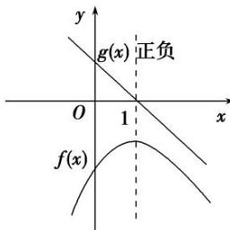
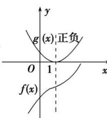
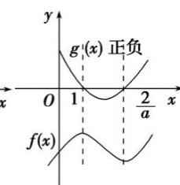
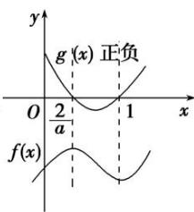
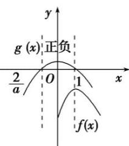

<!-- question-source:start -->
[例6] 已知函数 $f(x) = \frac{1}{2} ax^2 - (a + 2)x + 2\ln x (a \in \mathbf{R})$ .

(1)若 a=0，求证： $f(x)<0;$

(2)讨论函数 $f(x)$ 零点的个数.

[破题思路]
(1) 当 $a = 0$ 时, $f(x) = -2x + 2\ln x (x > 0)$ , $f'(x) = -2 + \frac{2}{x} = \frac{2(1 - x)}{x}$ , 设 $g(x) = 1 - x$ , 根据 $g(x)$ 的正负可画出 $f(x)$ 的图象如图 (1)所示.
(2) $f'(x) = \frac{(x - 1)(ax - 2)}{x} (x > 0)$ , 令 $g(x) = (x - 1)(ax - 2)$ , 当 $a = 0$ 时, 由
(1)知 $f(x)$ 没有零点; 当 $a > 0$ 时, 画 $g(x)$ 的正负图象时, 需分 $\frac{2}{a} = 1$ , $\frac{2}{a} > 1$ , $\frac{2}{a} < 1$ 三种情形进行讨论, 再根据极值、端点走势可画出 $f(x)$ 的图象, 如图
(2)
(3)
(4)所示; 当 $a < 0$ 时, 同理可得图
(5). 综上, 易得 $f(x)$ 的零点个数.

  
(1)

  
(2)

  
(3)

  
(4)

  
(5)

[规范解答]
(1) 当 a=0 时， $f'(x)=-2+\frac{2}{x}=\frac{2(1-x)}{x}$ ，由 $f'(x)=0$ 得 x=1.

当 0<x<1 时， $f'(x)>0$ ， $f(x)$ 在 $(0,1)$ 上单调递增；当 x>1 时， $f(x)<0$ ， $f(x)$ 在 $(1,+\infty)$ 上单调递减。所以 $f(x)\leq f(x)_{\max}=f
(1)=-2$ ，即 $f(x)<0$ 。

(2)由题意知 $f'(x)=ax-(a+2)+\frac{2}{x}=\frac{ax^{2}-(a+2)x+2}{x}=\frac{(x-1)(ax-2)}{x}(x>0),$

当 a=0 时，由第
(1)问可得函数 $f(x)$ 没有零点.

当 a>0 时，①当 $\frac{2}{a}=1$ ，即 a=2 时， $f'(x)\geq0$ 恒成立，仅当 x=1 时取等号，

函数 $f(x)$ 在 $(0, +\infty)$ 上单调递增，又 $f
(1) = -\frac{1}{2} a - 2 = -\frac{1}{2} \times 2 - 2 < 0$

当 $x \to +\infty$ 时， $f(x) \to +\infty$ ，所以函数 $f(x)$ 在区间 $(0, +\infty)$ 上有一个零点.

②当 $\frac{2}{a}>1$ ，即0<a<2时，若0<x<1或 $x>\frac{2}{a}$ ，则 $f'(x)>0$ ， $f(x)$ 在 $(0,1)$ 和 $\left(\frac{2}{a},+\infty\right)$ 上单调递增；
若 $1 < x < \frac{2}{a}$ ，则 $f'(x) < 0$ ， $f(x)$ 在 $\left(1, \frac{2}{a}\right)$ 上单调递减.

又 $f
(1) = \frac{1}{2} a - (a + 2) + 2\ln 1 = -\frac{1}{2} a - 2 < 0$ ，则 $f\left(\frac{2}{a}\right) < f (1) < 0$ ，

当 $x \to +\infty$ 时， $f(x) \to +\infty$ ，所以函数 $f(x)$ 仅有一个零点在区间 $\left(\frac{2}{a}, +\infty\right)$ 上；

③当 $0 < \frac{2}{a} < 1$ ，即 a > 2 时，若 $0 < x < \frac{2}{a}$ 或 x > 1，则 $f'(x) > 0$ ， $f(x)$ 在 $\left(0, \frac{2}{a}\right)$ 和 $(1, +\infty)$ 上单调递增；

若 $\frac{2}{a}<x<1$ ，则 $f'(x)<0$ ， $f(x)$ 在 $\left(\begin{matrix}\frac{2}{a},&1\end{matrix}\right)$ 上单调递减.

因为 a>2，所以 $f\left(\frac{2}{a}\right)=-\frac{2}{a}-2+2\ln\frac{2}{a}<-\frac{2}{a}-2+2\ln1<0$ ，又 $x\to+\infty$ 时， $f(x)\to+\infty$

所以函数 $f(x)$ 仅有一个零点在区间 $(1, +\infty)$ 上.

当 $\frac{2}{a}<0$ ，即a<0时，若0<x<1， $f'(x)>0$ ， $f(x)$ 在(0,1)上单调递增；

若 $x > 1$ ， $f^{\prime}(x) <   0$ ， $f(x)$ 在 $(1, + \infty)$ 上单调递减．当 $x\to 0$ 时， $f(x)\rightarrow -\infty$ ，当 $x\to +\infty$ 时， $f(x)\rightarrow -\infty$

又 $f
(1) = \frac{1}{2} a - (a + 2) + 2\ln 1 = -\frac{1}{2} a - 2 = \frac{-a - 4}{2}.$

当 $f
(1) = \frac{-a - 4}{2} > 0$ ，即 $a < -4$ 时，函数 $f(x)$ 有两个零点；

当 $f
(1) = \frac{-a - 4}{2} = 0$ ，即 $a = -4$ 时，函数 $f(x)$ 有一个零点；

当 $f
(1) = \frac{-a - 4}{2} < 0$ ，即 $-4 < a < 0$ 时，函数 $f(x)$ 没有零点.

综上，当 $a < -4$ 时，函数 $f(x)$ 有两个零点；当 $a = -4$ 时，函数 $f(x)$ 有一个零点；当 $-4 < a \leq 0$ 时，

函数 $f(x)$ 没有零点；当 a>0 时，函数 $f(x)$ 有一个零点.

[题后悟通] 解决本题运用了分类、分层的思想方法，表面看起来非常繁杂。但若能用好“双图法”处理问题，可回避不等式 $f'(x) > 0$ 与 $f'(x) < 0$ 的求解，特别是含有参数的不等式求解，而从 $f'(x)$ 抽象出与其正负有关的函数 $g(x)$ ，画图更方便，观察图形即可直观快速地得到 $f(x)$ 的单调性，大大提高解题的效率。

[对点训练]
<!-- question-source:end -->
