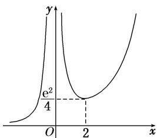

> [!faq]- 《专题37 讨论函数零点或方程根的个数问题-导数》例题解析
>
> > [!success]- **【答案】** 详见解析
>
> > [!note]- **【解析】**
> > (1)求 $f(x)$ 的单调区间；
> >
> > (2)讨论方程 $f(x)=1$ 根的个数.
> >
> > [规范解答]
> > (1)函数 $f(x)$ 的定义域为 $(0, +\infty)$ , $f'(x) = \frac{a - b - a\ln x}{x^2}$ , 由 $f' (1) = a - b = -a$ , 得 $b = 2a$ , 所以 $f(x) = \frac{a(\ln x + 2)}{x}$ , $f'(x) = -\frac{a(\ln x + 1)}{x^2}$ .
> >
> > 当 $a > 0$ 时，由 $f'(x) > 0$ ，得 $0 < x < \frac{1}{\mathrm{e}}$ ；由 $f(x) < 0$ ，得 $x > \frac{1}{\mathrm{e}}$
> >
> > 当 $a < 0$ 时，由 $f'(x) > 0$ ，得 $x > \frac{1}{\mathrm{e}}$ ；由 $f'(x) < 0$ ，得 $0 < x < \frac{1}{\mathrm{e}}$
> >
> > 综上，当 $a > 0$ 时， $f(x)$ 的单调递增区间为 $\left[0, \frac{1}{\mathrm{e}}\right]$ ，单调递减区间为 $\left[\frac{1}{\mathrm{e}}, +\infty\right]$ ；当 $a < 0$ 时， $f(x)$ 的单调递增区间为 $\left[\frac{1}{\mathrm{e}}, +\infty\right]$ ，单调递减区间为 $\left[0, \frac{1}{\mathrm{e}}\right]$ .
> >
> > (2) $f(x)=1$ ，即方程 $\frac{a\ln x+2a}{x}=1$ ，即方程 $\frac{1}{a}=\frac{\ln x+2}{x}$ ，构造函数 $h(x)=\frac{\ln x+2}{x}$
> >
> > 则 $h'(x)=-\frac{1+\ln x}{x^{2}}$ ，令 $h'(x)=0$ ，得 $x=\frac{1}{e}$ ，且在 $\left(0,\frac{1}{e}\right)$ 上 $h'(x)>0$ ，在 $\left(\frac{1}{e},+\infty\right)$ 上 $h'(x)<0$ ，即 $h(x)$ 在 $\left(0,\frac{1}{e}\right)$ 上单调递增，在 $\left[\frac{1}{e},+\infty\right]$ 上单调递减，所以 $h(x)_{\max}=h\left(\frac{1}{e}\right)=e.$
> >
> > 在 $\left(\frac{1}{e},+\infty\right)$ 上， $h(x)$ 单调递减且 $h(x)=\frac{\ln x+2}{x}>0$ ，当x无限增大时， $h(x)$ 无限接近0；
> >
> > 在 $\left(0,\frac{1}{\mathrm{e}}\right)$ 上， $h(x)$ 单调递增且当x无限接近0时， $\ln x+2$ 负无限大，故 $h(x)$ 负无限大.
> >
> > 故当 $0 < \frac{1}{a} < \mathrm{e}$ ，即 $a > \frac{1}{\mathrm{e}}$ 时，方程 $f(x) = 1$ 有两个不等实根，当 $a = \frac{1}{\mathrm{e}}$ 时，方程 $f(x) = 1$ 只有一个实根，当 $a < 0$ 时，方程 $f(x) = 1$ 只有一个实根.
> >
> > 综上可知，当 $a > \frac{1}{\mathrm{e}}$ 时，方程 $f(x) = 1$ 有两个实根；当 $a < 0$ 或 $a = \frac{1}{\mathrm{e}}$ 时，方程 $f(x) = 1$ 有一个实根；当 $0 < a < \frac{1}{\mathrm{e}}$ 时，方程 $f(x) = 1$ 无实根.
> >
> > ## [例 4] 已知函数 $f(x)=\mathrm{e}^{x}, x\in\mathbf{R}.$
> >
> > (1)若直线 y=kx 与 $f(x)$ 的反函数的图象相切，求实数 k 的值；
> >
> > (2)若 m<0，讨论函数 $g(x)=f(x)+mx^{2}$ 零点的个数.
> >
> > [规范解答]
> > (1) $f(x)$ 的反函数为 $y = \ln x, x > 0$ ，则 $y' = \frac{1}{x}$ .
> >
> > 设切点为 $(x_{0},\ln x_{0})$ ，则切线斜率为 $k=\frac{1}{x_{0}}=\frac{\ln x_{0}}{x_{0}}$ ，故 $x_{0}=e,\quad k=\frac{1}{e}$ .
> >
> > (2)函数 $g(x)=f(x)+mx^{2}$ 的零点的个数即是方程 $f(x)+mx^{2}=0$ 的实根的个数(当 x=0 时，方程无解)，等价于函数 $h(x)=\frac{\mathrm{e}^{x}}{x^{2}}(x\neq0)$ 与函数 y=-m 图象交点的个数． $h'(x)=\frac{\mathrm{e}^{x}(x-2)}{x^{3}}$ .
> >
> > 当 $x \in (-\infty, 0)$ 时， $h'(x) > 0$ ， $h(x)$ 在 $(-∞, 0)$ 上单调递增；
> >
> > 当 $x \in (0,2)$ 时， $h'(x) < 0$ ， $h(x)$ 在 $(0,2)$ 上单调递减；
> >
> > 当 $x \in (2, +\infty)$ 时， $h'(x) > 0$ ， $h(x)$ 在 $(2, +\infty)$ 上单调递增.
> >
> > 
> >
> > ∴ $h(x)$ 的大致图象如图：∴ $h(x)$ 在 $(0, +\infty)$ 上的最小值为 $h
> > (2)=\frac{e^{2}}{4}$ .
> >
> > ∴当 $-m\in\left(0,\frac{e^{2}}{4}\right)$ ，即 $m\in\left(-\frac{e^{2}}{4},0\right)$ 时，函数 $h(x)=\frac{e^{x}}{x^{2}}$ 与函数y=-m图象交点的个数为1；
> >
> > 当 $-m = \frac{\mathrm{e}^2}{4}$ ，即 $m = -\frac{\mathrm{e}^2}{4}$ 时，函数 $h(x) = \frac{\mathrm{e}^x}{x^2}$ 与函数 $y = -m$ 图象交点的个数为2；
> >
> > 当 $-m\in \left(\frac{\mathrm{e}^2}{4}, + \infty\right)$ ，即 $m\in -\infty$ ， $-\frac{\mathrm{e}^2}{4}$ 时，函数 $h(x) = \frac{\mathrm{e}^x}{x^2}$ 与函数 $y = -m$ 图象交点的个数为3.
> >
> > 综上所述，当 $m \in \left(-\infty, -\frac{\mathrm{e}^2}{4}\right)$ 时，函数 $g(x)$ 有三个零点；当 $m = -\frac{\mathrm{e}^2}{4}$ 时，函数 $g(x)$ 有两个零点；当 $m \in -\frac{\mathrm{e}^2}{4}$ ，0时，函数 $g(x)$ 有一个零点.
