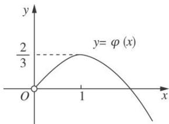

> [!faq]- 《专题37 讨论函数零点或方程根的个数问题-导数》例题解析
>
> > [!success]- **【答案】** 详见解析
>
> > [!note]- **【分析】**
> > 本题未单列分析。
>
> > [!note]- **【解析】**
> > (1)当 $m = \mathrm{e}(\mathrm{e}$ 为自然对数的底数)时，求 $f(x)$ 的极小值；
> > (2)讨论函数 $g(x) = f'(x) - \frac{x}{3}$ 零点的个数.
> > 3. 解析
> > (1)由题设，当 $m = \mathrm{e}$ 时， $f(x) = \ln x + \frac{\mathrm{e}}{x}$ ，则 $f'(x) = \frac{x - \mathrm{e}}{x^2}$ ，
> > ∴ 当 $x \in (0, e)$ 时， $f'(x) < 0$ ， $f(x)$ 在 $(0, e)$ 上单调递减；
> > 当 $x \in (\mathrm{e}, +\infty)$ 时， $f'(x) > 0$ ， $f(x)$ 在 $(\mathrm{e}, +\infty)$ 上单调递增，
> > ∴ 当 x=e 时， $f(x)$ 取得极小值 $f(e)=\ln e+\frac{e}{e}=2$ ，∴ $f(x)$ 的极小值为 2.
> > (2)由题设 $g(x) = f'(x) - \frac{x}{3} = \frac{1}{x} -\frac{m}{x^2} -\frac{x}{3} (x > 0)$ ，令 $g(x) = 0$ ，得 $m = -\frac{1}{3} x^3 +x(x > 0).$
> > 设 $\varphi(x) = -\frac{1}{3} x^3 + x (x > 0)$ ，则 $\varphi'(x) = -x^2 + 1 = -(x - 1)(x + 1)$ .
> > 当 $x \in (0, 1)$ 时， $\varphi'(x) > 0$ ， $\varphi(x)$ 在 $(0, 1)$ 上单调递增；
> > 当 $x \in (1, +\infty)$ 时， $\varphi'(x) < 0$ ， $\varphi(x)$ 在 $(1, +\infty)$ 上单调递减.
> > ∴ x=1 是 $\varphi(x)$ 的唯一极值点，且是极大值点，因此 x=1 也是 $\varphi(x)$ 的最大值点，
> > $\therefore \varphi (x)$ 的最大值为 $\varphi
> > (1) = \frac{2}{3}$ . 又 $\varphi (0) = 0$ ，结合 $y = \varphi (x)$ 的图象(如图)，可知，
> > 
> > - **①**：当 $m > \frac{2}{3}$ 时，函数 $g(x)$ 无零点；
> > - **②**：当 $m = \frac{2}{3}$ 时，函数 $g(x)$ 有且只有一个零点；
> > - **③**：当 $0<m<\frac{2}{3}$ 时，函数 $g(x)$ 有两个零点；
> > - **④**：当 $m\leq0$ 时，函数 $g(x)$ 有且只有一个零点.
> > 综上所述，当 $m > \frac{2}{3}$ 时，函数 $g(x)$ 无零点；当 $m = \frac{2}{3}$ 或 $m \leq 0$ 时，函数 $g(x)$ 有且只有一个零点；当 $0 < m < \frac{2}{3}$ 时，函数 $g(x)$ 有两个零点.
