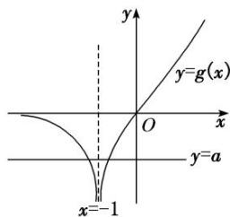

<!-- question-source:start -->
[例2] 已知函数 $f(x) = x\mathrm{e}^{x} - \frac{1}{2} a(x + 1)^{2}$ .

(1)若 $a = \mathrm{e}$ ，求函数 $f(x)$ 的极值；

(2)若函数 $f(x)$ 有两个零点，求实数a的取值范围.

[破题思路] 第
(1)问求 $f(x)$ 的极值，想到求 $f'(x)=0$ 的解，然后根据单调性求极值；第
(2)问求实数a的取值范围，想到建立关于a的不等式，给出函数 $f(x)$ 的解析式，并已知 $f(x)$ 有两个零点，利用 $f(x)$ 的图象与x轴有两个交点求解.

[规范解答]
(1)由题意知，当 $a = \mathrm{e}$ 时， $f(x) = x\mathrm{e}^x - \frac{1}{2}\mathrm{e}(x + 1)^2$ ，函数 $f(x)$ 的定义域为 $(- \infty, + \infty)$ ，

$f'(x)=(x+1)e^{x}-e(x+1)=(x+1)(e^{x}-e)$ . 令 $f'(x)=0$ ，解得 x=-1 或 x=1.

当 x 变化时， $f'(x)$ ， $f(x)$ 的变化情况如下表所示：

<table><tr><td>x</td><td> $(-\infty, -1)$ </td><td>-1</td><td> $(-1, 1)$ </td><td>1</td><td> $(1, +\infty)$ </td></tr><tr><td>f&#x27;(x)</td><td>+</td><td>0</td><td>-</td><td>0</td><td>+</td></tr><tr><td>f(x)</td><td></td><td>极大值 $-\frac{1}{e}$ </td><td></td><td>极小值-e</td><td></td></tr></table>

所以当 x = -1 时， $f(x)$ 取得极大值 $-\frac{1}{e}$ ；当 x = 1 时， $f(x)$ 取得极小值 -e.

(2) 法一：分类讨论法 $f'(x)=(x+1)e^{x}-a(x+1)=(x+1)(e^{x}-a)$ ,

若 a=0，易知函数 $f(x)$ 在 $(-∞, +∞)$ 上只有一个零点，故不符合题意.

若 a<0，当 $x\in(-\infty,-1)$ 时， $f'(x)<0$ ， $f(x)$ 单调递减；

当 $x \in (-1, +\infty)$ 时， $f'(x) > 0$ ， $f(x)$ 单调递增。

由 $f(-1) = -\frac{1}{\mathrm{e}} < 0$ ，且 $f
(1) = \mathrm{e} - 2a > 0$ ，当 $x \to -\infty$ 时， $f(x) \to +\infty$ ，

所以函数 $f(x)$ 在 $(-∞, +∞)$ 上有两个零点.

若 $\ln a < -1$ ，即 $0 < a < \frac{1}{\mathrm{e}}$ ，当 $x \in (-\infty, \ln a) \cup (-1, +\infty)$ 时， $f'(x) > 0$ ， $f(x)$ 单调递增；

当 $x \in (\ln a, -1)$ 时， $f'(x) < 0$ ， $f(x)$ 单调递减.

又 $f(\ln a) = a \ln a - \frac{1}{2} a (\ln a + 1)^2 < 0$ ，所以函数 $f(x)$ 在 $(- \infty, +\infty)$ 上至多有一个零点，故不符合题意.

若 $\ln a = -1$ ，即 $a = \frac{1}{e}$ ，当 $x \in (-\infty, +\infty)$ 时， $f'(x) \geq 0$ ， $f(x)$ 单调递增，故不符合题意.

若 $\ln a > -1$ ，即 $a > \frac{1}{e}$ ，当 $x \in (-\infty, -1) \cup (\ln a, +\infty)$ 时， $f'(x) > 0$ ， $f(x)$ 单调递增；

当 $x \in (-1, \ln a)$ 时， $f'(x) < 0$ ， $f(x)$ 单调递减.

又 $f(-1) = -\frac{1}{e} < 0$ ，所以函数 $f(x)$ 在 $(-∞, +∞)$ 上至多有一个零点，故不符合题意.

综上，实数 a 的取值范围是 $(-∞, 0)$ .

法二：数形结合法 令 $f(x) = 0$ ，即 $x\mathrm{e}^{x} - \frac{1}{2} a(x + 1)^{2} = 0$ ，得 $x\mathrm{e}^{x} = \frac{1}{2} a(x + 1)^{2}$ .

当 $x = -1$ 时，方程为 $-\mathrm{e}^{-1} = \frac{1}{2} a\times 0$ ，显然不成立，

所以 x = -1 不是方程的解，即 -1 不是函数 $f(x)$ 的零点.

当 $x \neq -1$ 时，分离参数得 $a = \frac{2xe^x}{(x + 1)^2}$ .

记 $g(x) = \frac{2x\mathrm{e}^x}{(x + 1)^2} (x\neq -1)$ ，则 $g^{\prime}(x) = \frac{(2x\mathrm{e}^{x})^{\prime}(x + 1)^{2} - [(x + 1)^{2}]^{\prime}\cdot 2x\mathrm{e}^{x}}{(x + 1)^{4}} = \frac{2\mathrm{e}^{x}(x^{2} + 1)}{(x + 1)^{3}}.$

当 x<-1 时， $g'(x)<0$ ，函数 $g(x)$ 单调递减；当 x>-1 时， $g'(x)>0$ ，函数 $g(x)$ 单调递增.

当 x=0 时， $g(x)=0$ ；当 $x\to-\infty$ 时， $g(x)\to0$ ；当 $x\to-1$ 时， $g(x)\to-\infty$ ；当 $x\to+\infty$ 时， $g(x)\to+\infty$ 。

故函数 $g(x)$ 的图象如图所示.

作出直线 y=a，由图可知，当 a<0 时，直线 y=a 和函数 $g(x)$ 的图象有两个交点，此时函数 $f(x)$ 有两个零点．故实数 a 的取值范围是 $(-∞, 0)$ .

[题后悟通] 利用函数零点的情况求参数范围的方法

(1)分离参数 $(a=g(x))$ 后，将原问题转化为 $y=g(x)$ 的值域(最值)问题或转化为直线y=a与 $y=g(x)$ 的图象的交点个数问题(优选分离、次选分类)求解；

(2)利用零点的存在性定理构建不等式求解;

(3)转化为两个熟悉的函数图象的位置关系问题，从而构建不等式求解
<!-- question-source:end -->
