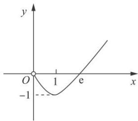

> [!faq]- 《专题38 由函数零点或方程根的个数求参数范围问题-导数》例题解析
>
> > [!success]- **【答案】** 详见解析
>
> > [!note]- **【分析】**
> > 本题未单列分析。
>
> > [!note]- **【解析】**
> > (1)求 $f(x)$ 的单调区间；
> > (2)若 $y = f(x) - m - 1$ 在定义域内有两个不同的零点，求实数 $m$ 的取值范围.
> > 3. 解析
> > (1)由题意知， $f'(x)=a+\ln x+1(x>0)$ ， $f' (1)=a+1=0$ ，解得 $a=-1$ ，当 $a=-1$ 时， $f(x)=-x+x\ln x$ ，即 $f'(x)=\ln x$ ，令 $f'(x)>0$ ，解得 $x>1$ ；令 $f'(x)<0$ ，解得 $0<x<1$ 。 $\therefore f(x)$ 在 $x=1$ 处取得极小值， $f(x)$ 的单调递增区间为 $(1,+\infty)$ ，单调递减区间为 $(0,1)$ 。
> > (2) $y=f(x)-m-1$ 在 $(0,+\infty)$ 上有两个不同的零点，可转化为 $f(x)=m+1$ 在 $(0,+\infty)$ 上有两个不同的根，也可转化为 $y=f(x)$ 与 $y=m+1$ 的图象有两个不同的交点，由
> > (1)知， $f(x)$ 在 $(0,1)$ 上单调递减，在 $(1,+\infty)$ 上单调递增， $f(x)_{\min}=f (1)=-1$ ，由题意得， $m+1>-1$ ，即 $m>-2$ ，①当 $0<x<1$ 时， $f(x)=x(-1+\ln x)<0$ ；当 $x>0$ 且 $x\to0$ 时， $f(x)\to0$ ；当 $x\to+\infty$ 时，显然 $f(x)\to+\infty$ 。如图，由图象可知， $m+1<0$ ，即 $m<-1$ ，②
> > 
> > 由①②可得-2<m<-1．故实数m的取值范围为 $(-2,-1)$ .
