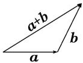
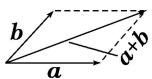
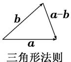
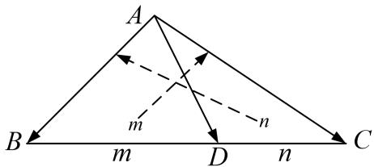
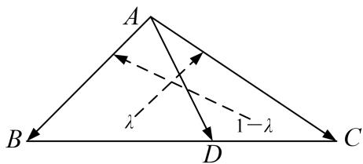

# 专题一 平面向量的线性运算

## 1. 向量的线性运算

<table><tr><td>向量运算</td><td colspan="2">加法</td><td>减法</td><td>数乘</td></tr><tr><td>几何表示</td><td>三角形法则首尾相接指向终点</td><td>平行四边形法则起点重合指向对顶点</td><td>起点重合指向被减向量</td><td>(1) $|\lambda a| = |\lambda||a|$ , (2)当 $\lambda>0$ 时, $\lambda a$ 与 $a$ 的方向相同;当 $\lambda<0$ 时, $\lambda a$ 与 $a$ 的方向相反;当 $\lambda=0$ 时, $\lambda a=0$ </td></tr><tr><td>坐标表示 $a=(x_1, y_1)$  $b=(x_2, y_2)$ </td><td colspan="2"> $a+b=(x_1+x_2, y_1+y_2)$ </td><td> $a-b=(x_1-x_2, y_1-y_2)$ </td><td> $\lambda a=(\lambda x_1, \lambda y_1)$ </td></tr></table>

## 2. 多边形法则

一般地，首尾顺次相接的多个向量的和等于从第一个向量起点指向最后一个向量终点的向量，即 $A_{1} \overrightarrow{A}_{2} + A_{2} \overrightarrow{A}_{3} + A_{3} \overrightarrow{A}_{4} + \ldots + A_{n-1} A_{n} = A_{1} \overrightarrow{A}_{n}$ ，特别地，一个封闭图形，首尾连接而成的向量和为零向量。

## 3. 平面向量基本定理

定理：如果 $e_{1}$ ， $e_{2}$ 是同一平面内的两个不共线向量，那么对于这一平面内的任意向量 a，存在唯一的一对实数 $\lambda_{1}$ ， $\lambda_{2}$ ，使 $a=\lambda_{1}e_{1}+\lambda_{2}e_{2}$ ，其中，不共线的向量 $e_{1}$ ， $e_{2}$ 叫作表示这一平面内所有向量的一组基底，记为 $\{e_{1}, e_{2}\}$ .

## 4. “爪”子定理

形式1：在 $\triangle ABC$ 中， $D$ 是 $BC$ 上的点，如果 $|BD|=m$ ， $|DC|=n$ ，则 $\overrightarrow{AD}=\frac{m}{m+n}\overrightarrow{AC}+\frac{n}{m+n}\overrightarrow{AB}$ ，其中 $\overrightarrow{AD}$ ， $\overrightarrow{AB}$ ， $\overrightarrow{AC}$ 知二可求一．特别地，若 $D$ 为线段 $BC$ 的中点，则 $\overrightarrow{AD}=\frac{1}{2}(\overrightarrow{AC}+\overrightarrow{AB})$ ．

形式1

形式2

形式2：在 $\triangle ABC$ 中， $D$ 是 $BC$ 上的点，且 $\overrightarrow{BD}=\lambda\overrightarrow{BC}$ ，则 $\overrightarrow{AD}=\lambda\overrightarrow{AC}+(1-\lambda)\overrightarrow{AB}$ ，其中 $\overrightarrow{AD},\overrightarrow{AB}$ ， $\overrightarrow{AC}$ 知二可求一．特别地，若 $D$ 为线段 $BC$ 的中点，则 $\overrightarrow{AD}=\frac{1}{2}(\overrightarrow{AC}+\overrightarrow{AB})$ ．

![[高中/总复习/专题/平面向量/专题1 平面向量的线性运算-平面向量/考点一_向量的线性运算/考点一_向量的线性运算.md]]
![[高中/总复习/专题/平面向量/专题1 平面向量的线性运算-平面向量/考点二_根据向量线性运算求参数/考点二_根据向量线性运算求参数.md]]
![[高中/总复习/专题/平面向量/专题1 平面向量的线性运算-平面向量/考点三_根据向量线性运算求参数的取值范围_最值_/考点三_根据向量线性运算求参数的取值范围_最值_.md]]
