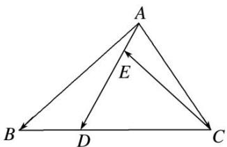

<!-- question-source:start -->
(4)如图，在 $\triangle ABC$ 中，点 $D$ 在 $BC$ 边上，且 $CD=2DB$ ，点 $E$ 在 $AD$ 边上，且 $AD=3AE$ ，则用向量 $\overrightarrow{AB}$ ， $\overrightarrow{AC}$ 表示 $\overrightarrow{CE}$ 为（）

A. $\frac{2}{9}\overrightarrow{AB} +\frac{8}{9}\overrightarrow{AC}$ B. $\frac{2}{9}\overrightarrow{AB} -\frac{8}{9}\overrightarrow{AC}$ C. $\frac{2}{9}\overrightarrow{AB} +\frac{7}{9}\overrightarrow{AC}$ D. $\frac{2}{9}\overrightarrow{AB} -\frac{7}{9}\overrightarrow{AC}$
<!-- question-source:end -->

![[高中/总复习/专题/平面向量/专题1 平面向量的线性运算-平面向量/考点01_向量的线性运算/例题/answers/Q00044986A1.md]]
