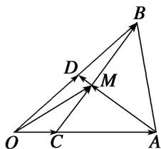

<!-- question-source:start -->
(6)如图所示，在 $\triangle ABO$ 中， $\overrightarrow{OC}=\frac{1}{4}\overrightarrow{OA}$ ， $\overrightarrow{OD}=\frac{1}{2}\overrightarrow{OB}$ ， $AD$ 与 $BC$ 相交于 $M$ ，设 $\overrightarrow{OA}=a$ ， $\overrightarrow{OB}=b$ ．则用 $a$ 和 $b$ 表示向量 $\overrightarrow{OM}=$ \_\_\_\_.

<!-- question-source:end -->

![[高中/总复习/专题/平面向量/专题1 平面向量的线性运算-平面向量/考点01_向量的线性运算/例题/answers/Q00044988A1.md]]
