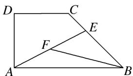

<!-- question-source:start -->
(9)如图，在直角梯形ABCD中， $AB = 2AD = 2DC$ ， $E$ 为 $BC$ 边上一点， $\overrightarrow{BC} = 3\overrightarrow{EC}$ ， $F$ 为 $AE$ 的中点，则 $\overrightarrow{BF} = (\quad)$

A. $\frac{2}{3}\overrightarrow{AB} -\frac{1}{3}\overrightarrow{AD}$ B. $\frac{1}{3}\overrightarrow{AB} -\frac{2}{3}\overrightarrow{AD}$ C. $-\frac{2}{3}\overrightarrow{AB} +\frac{1}{3}\overrightarrow{AD}$ D. $-\frac{1}{3}\overrightarrow{AB} +\frac{2}{3}\overrightarrow{AD}$
<!-- question-source:end -->

![[高中/总复习/专题/平面向量/专题1 平面向量的线性运算-平面向量/考点01_向量的线性运算/例题/answers/Q00044991A1.md]]
