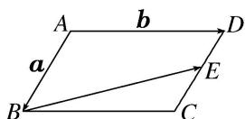

<!-- question-source:start -->
12. 如图，在平行四边形 $ABCD$ 中， $E$ 为 $DC$ 边的中点，且 $\overrightarrow{AB} = a$ ， $\overrightarrow{AD} = b$ ，则 $\overrightarrow{BE} = (\quad)$

A. $\frac{1}{2} b - a$ B. $\frac{1}{2} a - b$ C. $-\frac{1}{2} a + b$ D. $\frac{1}{2} b + a$
<!-- question-source:end -->

![[高中/总复习/专题/平面向量/专题1 平面向量的线性运算-平面向量/考点01_向量的线性运算/对点训练/answers/Q00045004A1.md]]
