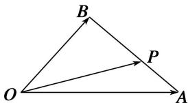

<!-- question-source:start -->
(1)如图，在 $\triangle OAB$ 中，P为线段AB上的一点， $\overrightarrow{OP}=x\overrightarrow{OA}+y\overrightarrow{OB}$ ，且 $\overrightarrow{BP}=2\overrightarrow{PA}$ ，则()

A. $x = \frac{2}{3}, y = \frac{1}{3}$ B. $x = \frac{1}{3}, y = \frac{2}{3}$ C. $x = \frac{1}{4}, y = \frac{3}{4}$ D. $x = \frac{3}{4}, y = \frac{1}{4}$
<!-- question-source:end -->

![[高中/总复习/专题/平面向量/专题1 平面向量的线性运算-平面向量/考点02_根据向量线性运算求参数/例题/answers/Q00045009A1.md]]
