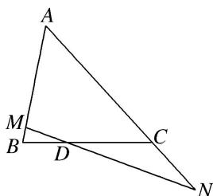

<!-- question-source:start -->
(3)如图, 在 $\triangle ABC$ 中, 点 $D$ 在线段 $BC$ 上, 且满足 $BD = \frac{1}{2} DC$ , 过点 $D$ 的直线分别交直线 $AB$ , $AC$ 于不同的两点 $M$ , $N$ , 若 $\overrightarrow{AM} = m\overrightarrow{AB}$ , $\overrightarrow{AN} = n\overrightarrow{AC}$ , 则 ( )

A. $m + n$ 是定值，定值为2 B. $2m + n$ 是定值，定值为3 C. $\frac{1}{m} +\frac{1}{n}$ 是定值，定值为2 D. $\frac{2}{m} +\frac{1}{n}$ 是定值，定值为3
<!-- question-source:end -->

![[高中/总复习/专题/平面向量/专题1 平面向量的线性运算-平面向量/考点02_根据向量线性运算求参数/例题/answers/Q00045011A1.md]]
