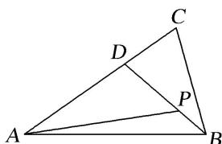

<!-- question-source:start -->
(4)如图，在 $\triangle ABC$ 中， $\overrightarrow{AD}=\frac{2}{3}\overrightarrow{AC}$ ， $\overrightarrow{BP}=\frac{1}{3}\overrightarrow{BD}$ ，若 $\overrightarrow{AP}=\lambda\overrightarrow{AB}+\mu\overrightarrow{AC}$ ，则 $\lambda+\mu$ 的值为()

A. $\frac{8}{9}$ B. $\frac{4}{9}$ C. $\frac{8}{3}$ D. $\frac{4}{3}$
<!-- question-source:end -->

![[高中/总复习/专题/平面向量/专题1 平面向量的线性运算-平面向量/考点02_根据向量线性运算求参数/例题/answers/Q00045012A1.md]]
