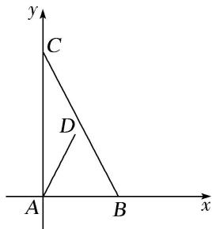

> [!faq]- 《专题1 平面向量的线性运算-平面向量》例题解析
>
> > [!success]- **【答案】** A
>
> > [!note]- **【分析】**
> > 本题未单列分析。
>
> > [!note]- **【解析】**
> > 答案 A 解析 如图，以 A 为原点，AB 所在直线为 x 轴，AC 所在直线为 y 轴建立平面直角坐标系，则 B 点的坐标为 $(1, 0)$ ，C 点的坐标为 $(0, 2)$ ，因为 $\angle DAB = 60^{\circ}$ ，所以设 D 点的坐标为 $(m, \sqrt{3}m)(m \neq 0)$ 。 $\overrightarrow{AD} = (m, \sqrt{3}m) = \lambda \overrightarrow{AB} + \mu \overrightarrow{AC} = \lambda (1, 0) + \mu (0, 2) = (\lambda, 2\mu)$ ，则 $\lambda = m$ ，且 $\mu = \frac{\sqrt{3}}{2}m$ ，所以 $\frac{\lambda}{\mu} = \frac{2\sqrt{3}}{3}$ 。
> >
> > 
