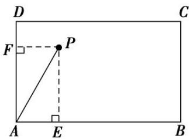

> [!faq]- 《专题1 平面向量的线性运算-平面向量》例题解析
>
> > [!success]- **【答案】** B
>
> > [!note]- **【分析】**
> > 本题未单列分析。
>
> > [!note]- **【解析】**
> > 答案 B 解析 如图，过点 P 作 $PE \perp AB$ 于点 E，作 $PF \perp AD$ 于点 F，则结合图形及题设得 $\overrightarrow{AP} = \overrightarrow{AF} + \overrightarrow{AE} = m\overrightarrow{AD} + n\overrightarrow{AB}$ ，所以可得 $|\overrightarrow{AF}| = m, |\overrightarrow{PF}| = |\overrightarrow{AE}| = \sqrt{3}n$ 。又 $\angle DAP = 30^{\circ}$ ，在 Rt△APF 中， $\tan \angle FAP = \tan 30^{\circ} = \frac{|\overrightarrow{PF}|}{|\overrightarrow{AF}|} = \frac{\sqrt{3}}{3}$ ，则 $\frac{\sqrt{3}}{3} = \frac{\sqrt{3}n}{m}$ ，化简得 $\frac{m}{n} = 3$ 。故选 B.
> > 
> > 优解：如图所示，假设点 P 在矩形的对角线 BD 上，由题意易知 $\left|\overrightarrow{DB}\right|=2,\quad\angle ADB=60^{\circ}$ ，又 $\angle DAP=30^{\circ}$ ，所以 $\angle DPA=90^{\circ}$ 。由 $\left|\overrightarrow{AD}\right|=1$ ，可得 $\left|\overrightarrow{DP}\right|=\frac{1}{2}=\frac{1}{4}\left|\overrightarrow{DB}\right|$ ，从而可得 $\overrightarrow{AP}=\overrightarrow{AD}+\overrightarrow{DP}=\overrightarrow{AD}+\frac{1}{4}\overrightarrow{DB}=\overrightarrow{AD}+\frac{1}{4}\left(\overrightarrow{AB}-\overrightarrow{AD}\right)=\frac{3}{4}\overrightarrow{AD}+\frac{1}{4}\overrightarrow{AB}$ 。又 $\overrightarrow{AP}=m\overrightarrow{AD}+\mathrm{n}\overrightarrow{AB}$ ，所以 $m=\frac{3}{4},\quad n=\frac{1}{4}$ ，则 $\frac{m}{n}=3$ 。
> >
> > 故选 **B**.
