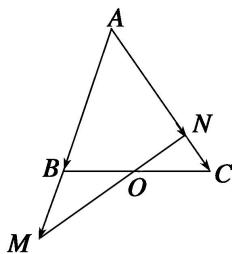

<!-- question-source:start -->
6. 如图所示, 在 $\triangle ABC$ 中, 点 $O$ 是 $BC$ 的中点. 过点 $O$ 的直线分别交直线 $AB$ 、 $AC$ 于不同的两点 $M$ 、 $N$ , 若 $\overrightarrow{AB} = m\overrightarrow{AM}$ , $\overrightarrow{AC} = n\overrightarrow{AN}$ , 则 $m + n$ 的值为 \_\_\_\_.

<!-- question-source:end -->

![[高中/总复习/专题/平面向量/专题1 平面向量的线性运算-平面向量/考点02_根据向量线性运算求参数/对点训练/answers/Q00045024A1.md]]
