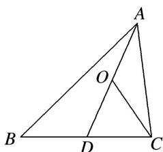

<!-- question-source:start -->
8. 如图所示, $AD$ 是 $\triangle ABC$ 的中线, $O$ 是 $AD$ 的中点, 若 $\overrightarrow{CO} = \lambda \overrightarrow{AB} + \mu \overrightarrow{AC}$ , 其中 $\lambda$ , $\mu \in \mathbf{R}$ , 则 $\lambda + \mu$ 的值为 ( )

A. $-\frac{1}{2}$ B. $\frac{1}{2}$ C. $-\frac{1}{4}$ D. $\frac{1}{4}$
<!-- question-source:end -->

![[高中/总复习/专题/平面向量/专题1 平面向量的线性运算-平面向量/考点02_根据向量线性运算求参数/对点训练/answers/Q00045026A1.md]]
