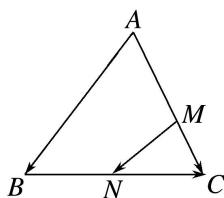

> [!faq]- 《专题1 平面向量的线性运算-平面向量》例题解析
>
> > [!success]- **【答案】** 详见解析
>
> > [!note]- **【分析】**
> > 本题未单列分析。
>
> > [!note]- **【解析】**
> > 答案 $\frac{1}{2} - \frac{1}{6}$ 解析 $\overrightarrow{MN} = \overrightarrow{MC} + \overrightarrow{CN} = \frac{1}{3}\overrightarrow{AC} + \frac{1}{2}\overrightarrow{CB} = \frac{1}{3}\overrightarrow{AC} + \frac{1}{2} (\overrightarrow{AB} -\overrightarrow{AC}) = \frac{1}{2}\overrightarrow{AB} -\frac{1}{6}\overrightarrow{AC} = x\overrightarrow{AB} +y\overrightarrow{AC},\therefore x$ $= \frac{1}{2},y = -\frac{1}{6}.$
> > 
