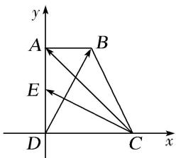

> [!faq]- 《专题1 平面向量的线性运算-平面向量》例题解析
>
> > [!success]- **【答案】** C
>
> > [!note]- **【解析】**
> > 答案 B 解析 建立如图所示的平面直角坐标系，则 $D(0, 0)$ .
> >
> > 
> >
> > 不妨设 AB=1，则 CD=AD=2，所以 $C(2,0)$ ， $A(0,2)$ ， $B(1,2)$ ， $E(0,1)$ ， $\therefore\overrightarrow{CA}=(-2,2)$ ， $\overrightarrow{CE}=(-2,1)$ ， $\overrightarrow{DB}=(1,2)$ ， $\because\overrightarrow{CA}=\lambda\overrightarrow{CE}+\mu\overrightarrow{DB}$ ， $\therefore(-2,2)=\lambda(-2,1)+\mu(1,2)$ ， $\therefore\left\{\begin{aligned}-2\lambda+\mu&=-2,\\ \lambda+2\mu&=2,\end{aligned}\right.$ 解得 $\left\{\begin{aligned}\lambda&=\frac{6}{5},\\ \mu&=\frac{2}{5},\end{aligned}\right.$ 则 $\lambda+\mu=\frac{8}{5}$ .
