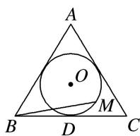

<!-- question-source:start -->
(2)如图，圆 $O$ 是边长为 $2\sqrt{3}$ 的等边三角形 $ABC$ 的内切圆，其与 $BC$ 边相切于点 $D$ ，点 $M$ 为圆上任意一点， $\overrightarrow{BM} = x\overrightarrow{BA} +y\overrightarrow{BD}(x,y\in \mathbf{R})$ ，则 $2x + y$ 的最大值为（）

A. $\sqrt{2}$ B. $\sqrt{3}$ C. 2 D. $2\sqrt{2}$
<!-- question-source:end -->

![[高中/总复习/专题/平面向量/专题1 平面向量的线性运算-平面向量/考点03_根据向量线性运算求参数的取值范围_最值_/例题/answers/Q00045043A1.md]]
