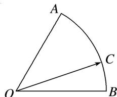

<!-- question-source:start -->
(4)如图，在扇形 OAB 中， $\angle AOB=\frac{\pi}{3}$ ，C 为弧 AB 上的一个动点，若 $\overrightarrow{OC}=x\overrightarrow{OA}+y\overrightarrow{OB}$ ，则 $x+3y$ 的取值范围是 \_\_\_\_.

<!-- question-source:end -->

![[高中/总复习/专题/平面向量/专题1 平面向量的线性运算-平面向量/考点03_根据向量线性运算求参数的取值范围_最值_/例题/answers/Q00045045A1.md]]
