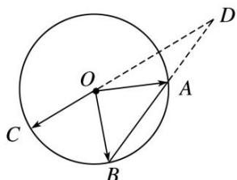

<!-- question-source:start -->
8. 如图所示, $A, B, C$ 是圆 $O$ 上的三点, 线段 $CO$ 的延长线与 $BA$ 的延长线交于圆 $O$ 外的一点 $D$ , 若 $\overrightarrow{OC} = m\overrightarrow{OA} + n\overrightarrow{OB}$ , 则 $m + n$ 的取值范围是 \_\_\_\_.

<!-- question-source:end -->

![[高中/总复习/专题/平面向量/专题1 平面向量的线性运算-平面向量/考点03_根据向量线性运算求参数的取值范围_最值_/对点训练/answers/Q00045053A1.md]]
