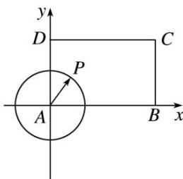

> [!faq]- 《专题1 平面向量的线性运算-平面向量》例题解析
>
> > [!success]- **【答案】** 详见解析
>
> > [!note]- **【解析】**
> > 答案 $\frac{\sqrt{10}}{2}$ 解析 建立如图所示的平面直角坐标系，设 $P(x, y), B(\sqrt{5}, 0), C(\sqrt{5}, \sqrt{3}), D(0, \sqrt{3})$ .
> >
> > $AP = \frac{\sqrt{5}}{2},\therefore x^{2} + y^{2} = \frac{5}{4}.$ 点 $P$ 满足的约束条件为 $\left\{ \begin{array}{l}0\leq x\leq \sqrt{5},\\ 0\leq y\leq \sqrt{3},\\ x^2 +y^2 = \frac{5}{4}, \end{array} \right.$ $\because \overrightarrow{AP} = \lambda \overrightarrow{AB} +\mu \overrightarrow{AD} (\lambda ,\mu \in \mathbf{R}),\therefore (x,y)$ $= \lambda (\sqrt{5},0) + \mu (0,\sqrt{3}),\therefore \left\{ \begin{array}{ll}x = \sqrt{5}\lambda ,\\ y = \sqrt{3}\mu , \end{array} \right.$ $\therefore x + y = \sqrt{5}\lambda +\sqrt{3}\mu .$ $\because x + y\leq \sqrt{2(x^2 + y^2)} = \sqrt{2\times\frac{5}{4}} = \frac{\sqrt{10}}{2},$ 当且仅当 $x = y$ 时取等号，∴ $\sqrt{5}\lambda +\sqrt{3}\mu$ 的最大值为 $\frac{\sqrt{10}}{2}.$
> >
> > 
