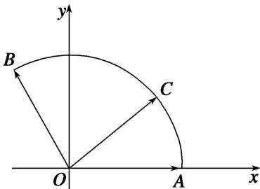

> [!faq]- 《专题1 平面向量的线性运算-平面向量》例题解析
>
> > [!success]- **【答案】** 详见解析
>
> > [!note]- **【分析】**
> > 本题未单列分析。
>
> > [!note]- **【解析】**
> > 答案 2 解析 以 O 为坐标原点， $\overrightarrow{OA}$ 所在的直线为 x 轴建立平面直角坐标系，如图所示，则 A(1, 0),
> > 
> > $B(-\frac{1}{2}, \frac{\sqrt{3}}{2})$ ，设 $\angle AOC = \alpha (\alpha \in [0, \frac{2\pi}{3}])$ ，则 $C(\cos \alpha, \sin \alpha)$ ，由 $\overrightarrow{OC} = x\overrightarrow{OA} + y\overrightarrow{OB}$ ，得 $\left\{ \begin{array}{l} \cos \alpha = x - \frac{1}{2}y \\ \sin \alpha = \frac{\sqrt{3}}{2}y \end{array} \right.$ ，所以 $x = \cos \alpha + \frac{\sqrt{3}}{3}\sin \alpha$ ， $y = \frac{2\sqrt{3}}{3}\sin \alpha$ ，所以 $x + y = \cos \alpha + \sqrt{3}\sin \alpha = 2\sin (\alpha + \frac{\pi}{6})$ ，又 $\alpha \in [0, \frac{2\pi}{3}]$ ，所以当 $\alpha = \frac{\pi}{3}$ 时， $x + y$ 取得最大值 2.
