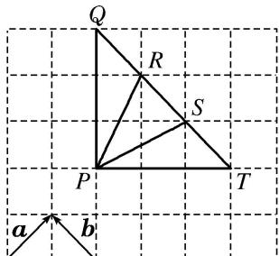

<!-- question-source:start -->
(5)如图所示，下列结论正确的是()

① $\overrightarrow{PQ}=\frac{3}{2}\boldsymbol{a}+\frac{3}{2}\boldsymbol{b};$ ② $\overrightarrow{PT}=\frac{3}{2}\boldsymbol{a}-\boldsymbol{b};$ ③ $\overrightarrow{PS}=\frac{3}{2}\boldsymbol{a}-\frac{1}{2}\boldsymbol{b};$ ④ $\overrightarrow{PR}=\frac{3}{2}\boldsymbol{a}+\boldsymbol{b}.$

A. ①② B. ③④ C. ①③ D. ②④
<!-- question-source:end -->

![[高中/总复习/专题/平面向量/专题1 平面向量的线性运算-平面向量/考点一_向量的线性运算/例题选讲/例题/answers/Q00033193A1.md]]
