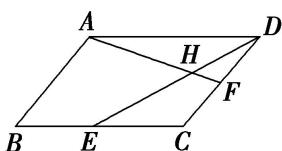

<!-- question-source:start -->
(8)在平行四边形ABCD中，E，F分别是BC，CD的中点，DE交AF于H，记 $\overrightarrow{AB}$ ， $\overrightarrow{BC}$ 分别为 $a$ ， $b$ ，则 $\overrightarrow{AH} = (\quad)$

A. $\frac{2}{5} a - \frac{4}{5} b$ B. $\frac{2}{5} a + \frac{4}{5} b$ C. $-\frac{2}{5} a + \frac{4}{5} b$ D. $-\frac{2}{5} a - \frac{4}{5} b$
<!-- question-source:end -->

![[高中/总复习/专题/平面向量/专题1 平面向量的线性运算-平面向量/考点一_向量的线性运算/例题选讲/例题/answers/Q00033196A1.md]]
