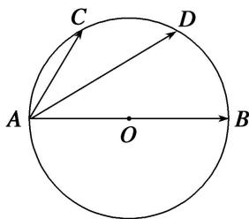

<!-- question-source:start -->
(10)如图，已知 $AB$ 是圆 $O$ 的直径，点 $C, D$ 是半圆弧的两个三等分点， $\overrightarrow{AB} = \boldsymbol{a}$ ， $\overrightarrow{AC} = \boldsymbol{b}$ ，则 $\overrightarrow{AD}$ 等于（）

A. $a - \frac{1}{2} b$ B. $\frac{1}{2} a - b$ C. $a + \frac{1}{2} b$ D. $\frac{1}{2} a + b$
<!-- question-source:end -->

![[高中/总复习/专题/平面向量/专题1 平面向量的线性运算-平面向量/考点一_向量的线性运算/例题选讲/例题/answers/Q00033198A1.md]]
