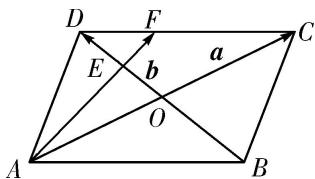

> [!faq]- 教师版例题解析
>
> > [!success]- **【答案】** B
>
> > [!note]- **【分析】**
> > 本题未单列分析。
>
> > [!note]- **【解析】**
> > 答案 B 解析 如图，根据题意，得 $\overrightarrow{AB} = \frac{1}{2}\overrightarrow{AC} +\frac{1}{2}\overrightarrow{DB} = \frac{1}{2} (\pmb {a} - \pmb {b})$ ， $\overrightarrow{AD} = \frac{1}{2}\overrightarrow{AC} +\frac{1}{2}\overrightarrow{BD} = \frac{1}{2} (\pmb {a} + \pmb {b})$ .令 $\overrightarrow{AF} =$ $t\overrightarrow{AE}$ ，则 $\overrightarrow{AF} = t(\overrightarrow{AB} +\overrightarrow{BE}) = t\left( \begin{array}{ll}\overrightarrow{AB} +\frac{3}{4}\overrightarrow{BE} \end{array} \right) = \frac{t}{2}\pmb {a} + \frac{t}{4}\pmb {b}$ 由 $\overrightarrow{AF} = \overrightarrow{AD} +\overrightarrow{DF}$ ，令 $\overrightarrow{DF} = s\overrightarrow{DC}$ ，又 $\overrightarrow{AD} = \frac{1}{2} (\pmb {a} + \pmb {b})$ ， $\overrightarrow{DF} =$ $\frac{s}{2}\pmb {a} - \frac{s}{2}\pmb {b}$ ，所以 $\overrightarrow{AF} = \frac{s + 1}{2}\pmb {a} + \frac{1 - s}{2}\pmb {b}$ ，所以 $\left\{ \begin{array}{ll}\frac{t}{2} = \frac{s + 1}{2},\\ \frac{t}{4} = \frac{1 - s}{2}, \end{array} \right.$ 解方程组得 $\left\{ \begin{array}{ll}s = \frac{1}{3},\\ t = \frac{4}{3}, \end{array} \right.$ 把 $s$ 代入即可得到 $\overrightarrow{AF} = \frac{2}{3}\pmb {a}$ $+\frac{1}{3}\pmb {b}$ ，故选B.
> > 
> > 另解 如图， $\overrightarrow{AF} = \overrightarrow{AD} + \overrightarrow{DF}$ ，由题意知， $DE:BE = 1:3 = DF:AB$ ，故 $\overrightarrow{DF} = \frac{1}{3}\overrightarrow{AB}$ ，则 $\overrightarrow{AF} = \frac{1}{2} a + \frac{1}{2} b + \frac{1}{3}\left(\frac{1}{2} a - \frac{1}{2} b\right) = \frac{2}{3} a + \frac{1}{3} b.$
