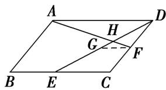

> [!faq]- 教师版例题解析
>
> > [!success]- **【答案】** B
>
> > [!note]- **【分析】**
> > 本题未单列分析。
>
> > [!note]- **【解析】**
> > 答案 B 解析 如图，过点 F 作 BC 的平行线交 DE 于 G，则 G 是 DE 的中点，且 $\overrightarrow{GF} = \frac{1}{2} \overrightarrow{EC} = \frac{1}{4} \overrightarrow{BC}$ ， $\therefore\overrightarrow{GF}=\frac{1}{4}\overrightarrow{AD}$ ，易知 $\triangle AHD\sim\triangle FHG$ ，从而 $\overrightarrow{HF}=\frac{1}{4}\overrightarrow{AH}$ ， $\therefore\overrightarrow{AH}=\frac{4}{5}\overrightarrow{AF}$ ， $\overrightarrow{AF}=\overrightarrow{AD}+\overrightarrow{DF}=b+\frac{1}{2}a,\therefore\overrightarrow{AH}=\frac{4}{5}\left(b+\frac{1}{2}a\right)=\frac{2}{5}a+\frac{4}{5}b$ ，故选 B.
> > 
