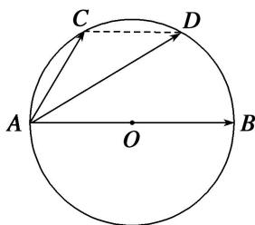

> [!faq]- 教师版例题解析
>
> > [!success]- **【答案】** D
>
> > [!note]- **【分析】**
> > 本题未单列分析。
>
> > [!note]- **【解析】**
> > 答案 D 解析 连接 CD，由点 C, D 是半圆弧的三等分点，得 $CD \parallel AB$ 且 $\overrightarrow{CD} = \frac{1}{2}\overrightarrow{AB} = \frac{1}{2}\overrightarrow{a}$ ，所以 $\overrightarrow{AD} = \overrightarrow{AC} + \overrightarrow{CD} = \overrightarrow{b} + \frac{1}{2}\overrightarrow{a}$ .
> > 
